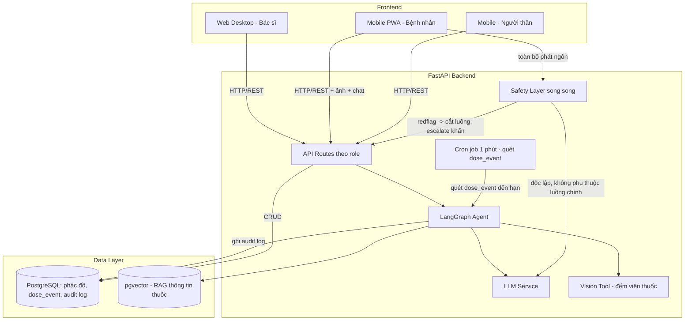
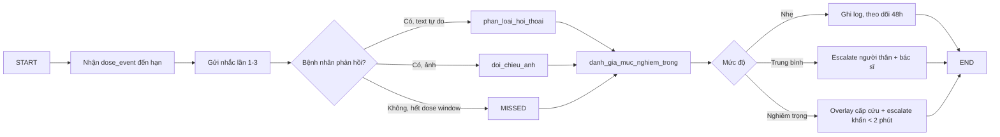
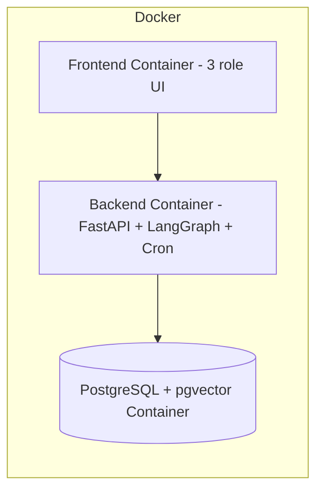
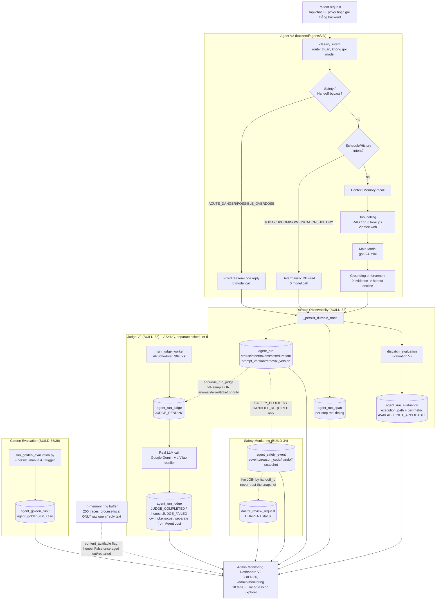

# Architecture Document — VMEC-04

## System Overview

VMEC-04 là một AI Agent nhắc thuốc & theo dõi tuân thủ điều trị, phục vụ 3 vai trò: **Bác sĩ** (web desktop, tạo/duyệt phác đồ), **Bệnh nhân** (mobile PWA, xác nhận thuốc qua ảnh + hội thoại), và **Người thân/Caregiver** (mobile, duyệt ảnh + xử lý cảnh báo). Agent chỉ hoạt động trên phác đồ đã được bác sĩ duyệt (Human-in-the-loop), sinh lịch nhắc, thu thập bằng chứng tuân thủ (ảnh + hội thoại tự nhiên), và escalate theo mức độ nghiêm trọng — song song với một lớp an toàn (safety layer) độc lập chuyên phát hiện triệu chứng nguy hiểm.

## Architecture Diagram

## Components

### 1. Frontend

- **Bác sĩ (Web Desktop, React/Next.js):** Tạo & duyệt phác đồ, xem preview timeline lịch nhắc, duyệt đề xuất đổi lịch (HITL), dashboard tuân thủ real-time, nhận cảnh báo nghiêm trọng, xem audit log.
- **Bệnh nhân (Mobile PWA):** Nhận nhắc thuốc 3 cấp độ, xác nhận bằng ảnh (fallback nút bấm), chat tự nhiên với agent.
- **Người thân (Mobile):** Duyệt ảnh xác nhận trong 1 giờ, xử lý hàng đợi cảnh báo có ngữ cảnh, xem lịch sử/heatmap.
- **State Management:** State cục bộ theo phiên (dose window, trạng thái phản hồi) đồng bộ qua API, không phụ thuộc localStorage phía client cho dữ liệu quan trọng.

### 2. Backend (FastAPI)

- **Purpose:** Trung gian giữa 3 frontend và AI Agent; enforce quyền theo role (bác sĩ/bệnh nhân/người thân); ghi audit log cho mọi hành động của agent.
- **API Design:** RESTful, phân quyền theo role.
- **Authentication:** JWT theo role.
- **Scheduler:** Một cron job chạy mỗi **1 phút**, quét bảng `dose_event` để tìm liều đến hạn nhắc/nhắc lại/đóng dose window — thay cho việc tạo Celery task riêng cho từng liều thuốc (đơn giản hoá vận hành, đủ đáp ứng yêu cầu độ trễ nhắc < 1 phút). Có biến **time-offset** để tăng tốc mô phỏng escalation khi demo.

### 3. AI Agent (LangGraph)

- **Agent Type:** Custom graph theo luồng nghiệp vụ (không thuần ReAct), có nhánh rẽ HITL bắt buộc.
- **State:** phác đồ đã duyệt, dose_event hiện tại, lịch sử hội thoại, trạng thái xác nhận (Taken/Missed/Delayed/SideEffect), kết quả đối chiếu ảnh, mức độ nghiêm trọng.
- **Nodes chính:**
  1. `parse_phac_do` — chuyển phác đồ đã duyệt thành cấu trúc dữ liệu
  2. `sinh_lich_nhac` — sinh lịch nhắc + dose window ±30 phút, preview timeline cho bác sĩ
  3. `phan_loai_hoi_thoai` — phân loại câu trả lời tự do thành 4 nhãn, hỏi lại nếu confidence thấp
  4. `doi_chieu_anh` — vision tool đếm viên thuốc, đối chiếu phác đồ (tối đa 2 lần chụp lại trước khi chuyển caregiver review)
  5. `danh_gia_muc_nghiem_trong` — kết hợp loại thuốc + RAG (pgvector) để phân loại Nhẹ/Trung bình/Nghiêm trọng
  6. `escalate` — báo người thân/bác sĩ theo mức rủi ro
  7. `hitl_duyet_lich` — mọi đề xuất đổi lịch nhắc dừng lại chờ bác sĩ duyệt, agent không tự áp dụng
- **Tools:** Vision (đếm viên thuốc từ ảnh), RAG trên pgvector (thông tin thuốc có nguồn: chỉ định, tác dụng phụ, tương tác), notification (push cảnh báo).
- **Flow:**

### 4. Database

- **Type:** PostgreSQL.
- **Tables (dự kiến):** `users` (role-based), `prescriptions` (phác đồ, trạng thái chờ duyệt/đã kích hoạt), `dose_event` (lịch nhắc, dose window, trạng thái), `conversations` (log hội thoại + confidence), `photo_verifications`, `escalations`, `audit_log` (reasoning, confidence, nguồn RAG cho mọi hành động agent).
- **Migrations:** Alembic.

### 5. Vector Store / RAG

- **Type:** **pgvector** (extension trong PostgreSQL) — dùng làm lớp RAG nhẹ, không triển khai vector DB riêng biệt, giảm độ phức tạp vận hành trong timeline 5 tuần.
- **Embeddings:** [model cụ thể — cần chốt ở Tuần 2 cùng nguồn dữ liệu thuốc]
- **Purpose:** Truy xuất thông tin thuốc có nguồn (chỉ định, tác dụng phụ, tương tác) để agent đánh giá mức nghiêm trọng và trả lời câu hỏi của bệnh nhân mà không "bịa" thông tin — đây là rủi ro an toàn cao nhất của dự án theo BRIEF.

### 6. Safety Layer (song song)

- **Kiến trúc:** Dual-layer classifier — **keyword rules** + **LLM layer**, kết hợp bằng **OR logic** để tối đa hoá recall phát hiện triệu chứng nghiêm trọng (khó thở, đau ngực, ngất...).
- **Đặc điểm:** Chạy độc lập với luồng `phan_loai_hoi_thoai` chính, không bị chặn bởi lỗi/độ trễ của luồng chính; nếu một trong hai lớp cờ đỏ → cắt ngang luồng hiện tại, hiện overlay cấp cứu, push khẩn người thân + bác sĩ.
- **Đánh đổi:** Chấp nhận báo thừa (false positive) hơn bỏ sót (false negative) — mục tiêu recall ≥ 90-95%.

## Data Flow

1. Bác sĩ tạo phác đồ → duyệt (HITL) → agent kích hoạt sinh lịch nhắc.
2. Cron job quét `dose_event` mỗi phút, gửi nhắc theo 3 cấp độ tăng dần.
3. Bệnh nhân phản hồi bằng ảnh và/hoặc hội thoại tự nhiên.
4. Agent phân loại (NLU + vision), đồng thời safety layer quét song song mọi phát ngôn.
5. Agent đối chiếu loại thuốc + RAG (pgvector) để xác định mức nghiêm trọng.
6. Escalate tới người thân/bác sĩ theo mức rủi ro; mọi hành động ghi vào audit log.
7. Dashboard bác sĩ cập nhật real-time (tuân thủ tự khai vs có xác minh).

## Deployment Architecture

## Security

- API keys lưu trong `.env` (không commit; đã chặn qua `.gitignore`, bao gồm `.ai-log/*.jsonl`)
- Đăng nhập & phân quyền theo role (bác sĩ/bệnh nhân/người thân)
- Mã hoá PHI/PII (dữ liệu y tế cá nhân)
- Input validation via Pydantic
- Rate limiting trên API endpoints
- CORS cấu hình theo domain frontend
- Audit log đầy đủ cho mọi hành động AI (reasoning, confidence, nguồn RAG) — bắt buộc để bác sĩ tin tưởng và truy vết sự cố

## Design Decisions

| Decision | Choice | Reason |
|----------|--------|--------|
| Framework | FastAPI | Async, auto-docs, type-safe |
| Agent | LangGraph | Cần state phức tạp + nhánh HITL bắt buộc, không thuần ReAct |
| Scheduler | Cron job 1 phút quét `dose_event` | Đơn giản hơn per-dose Celery task, vẫn đáp ứng độ trễ nhắc < 1 phút trong timeline 5 tuần |
| Vector Store | pgvector (trong PostgreSQL) | Tránh thêm một service vector DB riêng — giảm độ phức tạp vận hành cho MVP |
| Safety Detection | Keyword rules OR LLM layer | Tối đa hoá recall triệu chứng nghiêm trọng, chấp nhận false positive |
| Photo Verification | Tối đa 2 lần chụp lại, sau đó fallback caregiver review | Cân bằng giữa trải nghiệm bệnh nhân và độ chính xác xác minh |
| Database | PostgreSQL | Hỗ trợ pgvector native, đủ mạnh cho quan hệ phác đồ/dose_event/audit log |

## Agent V2 Observability & Evaluation Pipeline (cập nhật BUILD-37, 2026-08-25)

*Phần trên (System Overview/Diagram/Components §1-2) mô tả kiến trúc Agent
gốc ("LangGraph Agent" + "Safety Layer song song") — đã được thay thế bởi
Agent V2 (`backend/agents/v2/`, router + tool-calling + safety xác định
trước Main Model, từ BUILD-16 trở đi). Việc viết lại toàn bộ tài liệu gốc
cho khớp Agent V2 nằm ngoài phạm vi BUILD-37 (chỉ release/verify BUILD-32→36,
không sửa runtime/router). Phần này bổ sung riêng — có phạm vi rõ — cho
pipeline observability/evaluation được BUILD-32→36 xây, đã verify thật
trên production trong BUILD-37.**

### Data flow thật (production, xác nhận qua BUILD-37)

### Nguyên tắc / source of truth (đã verify thật trên production, không chỉ trên giấy)

- **Metrics (status/intent/tokens/cost/spans/error_code/safety/Judge) luôn
  durable, độc lập ring buffer** — sống sót qua restart/redeploy. Chỉ
  RAW QUERY/REPLY TEXT phụ thuộc ring buffer (200-entry, in-memory,
  process-local, mất khi restart) — đây là giới hạn kiến trúc **có chủ
  đích** (privacy-minimization, quyết định từ trước BUILD-32), không phải
  thiếu sót. Dashboard phải render `content_available: false` trung thực
  khi đã mất, không bao giờ tái tạo/giả lập nội dung.
- **Judge là một ranh giới BẤT ĐỒNG BỘ thật** — chạy qua APScheduler job
  riêng (`_run_judge_worker`, tick 30s), tách hoàn toàn khỏi request/
  response cycle của chat. Một request luôn trả lời xong TRƯỚC KHI Judge
  từng chạm vào nó — đảm bảo bằng kiến trúc (2 tiến trình khác nhau theo
  thời gian), không phải try/except phòng thủ. Judge enqueue theo 2 kiểu:
  5% random sample (`enqueue_run_judge`) HOẶC ưu tiên tức thời cho
  ticket/safety-anomaly/error-fallback (`enqueue_ticket_judge`,
  `eligibility_reason=SAFETY_ANOMALY`/`ERROR_OR_FALLBACK`) — xác nhận thật
  trên production BUILD-37: request lỗi/fallback được judge dù roll ngẫu
  nhiên trượt.
- **Judge KHÔNG BAO GIỜ override SafetyDecision** — đúng theo thiết kế
  BUILD-34 (đã có structural test xác nhận zero `db.add`/`SafetyDecision(`
  trong hàm tạo `REVIEW_SUSPECTED_MISSED_RISK`), chỉ là tín hiệu review
  phụ, không viết lại `agent_safety_event`/`doctor_review_request`.
- **Provenance thật, không giả định** — production hiện dùng model chính
  `gpt-5.4-mini` (OpenAI), Judge dùng `anxs/gemini-3.7-flash-high` (Google,
  qua reseller OpenAI-compatible Vilao — `AGENT_JUDGE_BASE_URL=
  https://api.vilao.ai/v1`), KHÔNG giống config Vilao local — xác nhận
  bằng cách đọc thật `agent_run_judge.judge_provider`/`judge_model` từ
  các row Judge thật trên production trong BUILD-37, không giả định.
  Judge cost hiện `NOT_AVAILABLE` (Gemini/Vilao chưa có trong
  `AGENT_MODEL_PRICING_JSON`) — trung thực, không phải `$0` giả.
- **Golden Evaluation là quy trình thủ công/CI, không tự động chạy trên
  traffic thật** — `run_golden_evaluation.py --persist` ghi vào
  `agent_golden_run`/`agent_golden_run_case`; Dashboard đọc run gần nhất
  nếu có, hiển thị `has_run: false` trung thực nếu chưa từng persist
  (đúng trạng thái production ngay sau BUILD-37 release, trước khi ai
  chạy `--persist` lần đầu).
| Frontend | Next.js (bác sĩ), PWA (bệnh nhân), Mobile (người thân) | Khớp với thiết bị sử dụng thực tế của từng vai trò |