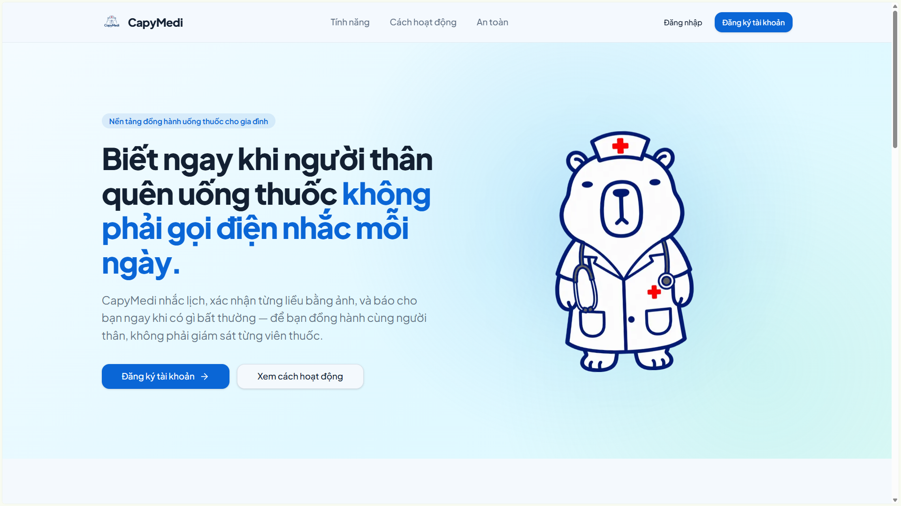
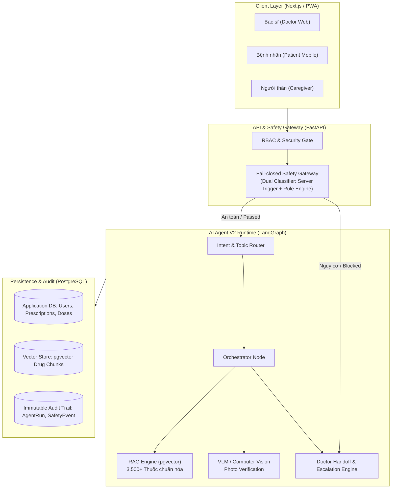

# 🏥 VMEC-04: AI Agent Nhắc Thuốc & Theo Dõi Tuân Thủ Điều Trị

> **Hệ thống AI Y tế Thông minh:** Giám sát tuân thủ dùng thuốc, xác nhận liều bằng thị giác máy tính & hội thoại tự nhiên, kiến trúc an toàn **Fail-safe** dành cho bệnh nhân mãn tính.



[](#-kiem-thu--chat-luong-ma-nguon)
[](#-kiem-thu--chat-luong-ma-nguon)
[](#-kiem-thu--chat-luong-ma-nguon)
[](#-live-demo--tai-khoan-thu-nghiem)
[](LICENSE)

---

## 🌐 Live Demo

| Thành phần                             | Đường dẫn Trực tiếp (Live URL)                                                                                            |    Trạng thái    |
| :--------------------------------------- | :------------------------------------------------------------------------------------------------------------------------------ | :-----------------: |
| 🖥️**Web Application (Frontend)** | [**https://c3-app-067.up.railway.app**](https://c3-app-067.up.railway.app)                                                 | 🟢`Active 200 OK` |
| 🔌**Backend API & Health Check**   | [**https://vmec-04be-production.up.railway.app/api/v1/status**](https://vmec-04be-production.up.railway.app/api/v1/status) | 🟢`Active 200 OK` |


## 📌 Vấn đề & Giải pháp (Problem & Solution)

### 1. Vấn đề thực tế (Clinical Pain Point)

- **Đối với Bệnh nhân:** Người cao tuổi mắc nhiều bệnh nền (tim mạch, huyết áp, tiểu đường) phải dùng nhiều loại thuốc vào nhiều khung giờ mỗi ngày, rất dễ quên liều, uống sai loại hoặc tự ý dừng thuốc.
- **Đối với Bác sĩ:** Không có dữ liệu khách quan về việc bệnh nhân có thực sự tuân thủ giữa 2 lần tái khám. Bác sĩ buộc phải dựa vào lời kể chủ quan, dẫn tới nguy cơ ra quyết định lâm sàng sai lệch (tăng liều hoặc đổi phác đồ không cần thiết).
- **Hạn chế của giải pháp truyền thống:** Các ứng dụng báo thức thông thường chỉ gửi thông báo một chiều, không tạo ra **bằng chứng khách quan** rằng thuốc đã được uống đúng cách.

### 2. Giải pháp VMEC-04

- 📸 **Xác nhận bằng Ảnh (Photo Verification):** Thị giác máy tính đối chiếu số lượng viên và dạng đóng gói với phác đồ đã được bác sĩ phê duyệt.
- 💬 **Hội thoại Tự nhiên (Agentic Dialog):** Trò chuyện tự nhiên bằng tiếng Việt, nhận diện trạng thái uống thuốc (*Taken / Missed / Delayed*) và phát hiện sớm triệu chứng tác dụng phụ.
- 🛡️ **Đánh giá Nguy cơ & RAG Y khoa:** Truy xuất thông tin thuốc chính xác từ cơ sở dữ liệu có nguồn (`pgvector`), tự động leo thang cảnh báo theo mức độ nguy hiểm lâm sàng.
- 👨‍⚕️ **Cơ chế Human-in-the-loop (HITL):** AI tuyệt đối không tự ý kê đơn hay đổi liều; mọi điều chỉnh phác đồ hoặc ca bệnh phức tạp đều được tự động chuyển tiếp tới bác sĩ phụ trách.

---

## 🏛️ Sơ đồ Kiến trúc & Luồng Xử lý (Architecture)

Hệ thống được thiết kế theo triết lý **Fail-safe (Fail-closed)** — tách biệt hoàn toàn tầng phân loại an toàn khỏi suy luận tự do của mô hình ngôn ngữ lớn (LLM).



---

## 🛠️ Công nghệ Sử dụng (Tech Stack)

| Thành phần              | Công nghệ / Thư viện               | Vai trò kỹ thuật                                                                    |
| :------------------------ | :------------------------------------- | :------------------------------------------------------------------------------------- |
| **AI Agent Core**   | LangGraph, LangChain, OpenAI / Claude  | Điều phối Agent V2, quản lý hội thoại đa lượt và suy luận an toàn         |
| **Backend API**     | FastAPI, Python 3.11+, Pydantic v2     | Xây dựng RESTful API hiệu năng cao, xác thực JWT và phân quyền RBAC           |
| **Vector DB & RAG** | PostgreSQL +`pgvector`               | Lưu trữ và tìm kiếm vector nhúng (Embedding) trên 3.500+ danh mục thuốc y tế |
| **Database & ORM**  | PostgreSQL 16, SQLAlchemy 2.0, Alembic | Quản lý quan hệ dữ liệu, thực thi Migration tự động                           |
| **Frontend**        | Next.js 14, React, Tailwind CSS        | Giao diện Responsive Web / PWA hỗ trợ cả Desktop bác sĩ và Mobile bệnh nhân   |
| **Safety & Vision** | Dual-layer Classifier, OpenCV, Pillow  | Phân loại từ chối rủi ro, đối chiếu thị giác hình ảnh thuốc               |
| **DevOps & CI/CD**  | Docker, GitHub Actions, Railway        | Tự động Lint (`Ruff`), Chạy Test (`Pytest`), Build Container và Deploy        |

---

## 🚀 Hướng dẫn Cài đặt & Khởi chạy (Quick Start)

### Yêu cầu tiên quyết

- Python 3.11+
- Node.js 20+ & `pnpm` / `npm`
- PostgreSQL 16 (hỗ trợ extension `pgvector`) hoặc Docker

---

### Cách 1: Khởi chạy bằng Docker Compose (Khuyến nghị)

```bash
# 1. Clone repository
git clone https://github.com/AI20K-Build-Phase-Cohort-3/P-067
cd P-067

# 2. Thiết lập biến môi trường
cp .env.example .env

# 3. Khởi động toàn bộ hệ thống (Database, Backend, Frontend)
docker-compose up --build -d

# 4. Kiểm tra trạng thái hoạt động
curl -s http://localhost:8000/api/v1/status
```

---

### Cách 2: Khởi chạy Local (Môi trường Phát triển)

#### 1. Cài đặt Backend

```bash
# Tạo và kích hoạt môi trường ảo Python
python -m venv .venv
source .venv/bin/activate    # Linux / macOS
# .venv\Scripts\Activate.ps1 # Windows PowerShell

# Cài đặt thư viện phụ thuộc
pip install -r requirements.txt

# Chạy Database Migrations
alembic upgrade head

# Khởi chạy Backend Server
uvicorn backend.main:app --host 0.0.0.0 --port 8000 --reload
```

#### 2. Cài đặt Frontend

```bash
cd frontend
pnpm install
pnpm dev
# Truy cập giao diện tại: http://localhost:3000
```

---

## 🧪 Kiểm thử & Chất lượng Mã nguồn (Testing & Quality Gates)

Hệ thống sở hữu bộ test tự động nghiêm ngặt được tích hợp trực tiếp vào quy trình CI/CD:

```bash
# 1. Kiểm tra quy chuẩn mã nguồn (Linting)
ruff check backend/ tests/

# 2. Chạy toàn bộ Test Suite (1.900+ test cases)
pytest tests/ -v --tb=short

# 3. Đo lường tỷ lệ bao phủ mã nguồn (Code Coverage)
pytest --cov=backend/agents/v2 --cov-report=term-missing tests/

# 4. Chạy bộ đánh giá xác thực Golden Set trên cơ sở dữ liệu thật
python scripts/agent_v2/run_golden_evaluation.py --deterministic-only --out-dir /tmp/golden-eval
```

### 📊 Kết quả Đo lường Thực tế

* **Tổng số bài test vượt qua:** **1.918 tests passed** (100% kịch bản an toàn lâm sàng pass).
* **Độ bao phủ module An toàn (`safety.py`):** **99% Line Coverage** (86/87 statements).
* **Độ bao phủ các module điều phối cốt lõi:** `tools.py` **91%**, `context.py` **87%**, `handoff.py` **85%**, `runtime.py` **80%**, `orchestrator.py` **77%**.
* **Độ trễ hệ thống (SLO Latency):** P50 đạt `3,38 giây`, P95 đạt `5,58 giây`, Tra cứu thuốc nhanh chỉ mất `0,27 giây` (Vượt trội mục tiêu cam kết `<1 phút` và `<2 phút`).

---

## 📁 Cấu trúc Thư mục Dự án (Project Structure)

```
P-067/
├── backend/                   # Backend FastAPI & Agent Logic
│   ├── agents/v2/             # LangGraph Agent V2 Core (Orchestrator, Safety, Memory, RAG)
│   ├── api/                   # RESTful API Endpoints (Chat, Doses, Prescriptions, Admin)
│   ├── db/                    # SQLAlchemy Database Models & Base Connection
│   ├── models/                # Pydantic Schemas & DTO Contracts
│   ├── services/              # Business Logic (Scheduling, Safety Domain, Auth, Images)
│   ├── vlm_demthuoc/          # Computer Vision Model & Image Verification Tool
│   ├── config.py              # Centralized Settings & Environment Validation
│   └── main.py                # FastAPI Application Entrypoint
├── frontend/                  # Next.js 14 Web Application
│   ├── src/app/               # App Router Pages (Doctor, Patient, Caregiver, Admin)
│   ├── src/components/        # Reusable UI Components & Tailwind Styling
│   └── Dockerfile             # Multi-stage Frontend Container Build
├── tests/                     # Automated Test Suite (130+ Test Files, 2.400+ Test Cases)
├── migrations/                # Alembic Database Migrations
├── docs/                      # 10 Deliverables + Tài liệu Kỹ thuật
│   ├── architecture.md        # #3  Kiến trúc hệ thống
│   ├── ai-logs.md             # #4  Bằng chứng tracing Agent
│   ├── video-demo.md          # #6  Link video demo
│   ├── pitch-deck.pdf         # #7  Slide thuyết trình (bản nộp BTC)
│   ├── pitch-deck.md          # #7  Kịch bản & dàn ý 10 slide
│   ├── journal.md             # #8  Nhật ký phát triển theo tuần
│   ├── worklog.md             # #9  Lịch sử làm việc theo ngày
│   └── evaluation.md          # #10 Bằng chứng đánh giá chất lượng
├── eval/                      # Dữ liệu Đánh giá & Báo cáo Thực nghiệm (Accuracy, Latency)
├── adrs/                      # Architecture Decision Records
├── specs/  planning/  tasks/  # Đặc tả, Sprint backlog, Task theo domain
├── chat-bot-build/            # Báo cáo từng vòng BUILD của Agent V2
├── data pharmacy/             # Dữ liệu thuốc Canonical V2 (bản thô đã nén, xem README-archive.md)
├── .ai-log/                   # Nhật ký Tracing & Lịch sử Reasoning của AI Agent
├── .github/workflows/         # CI/CD Workflows (Lint, Test, Golden-Smoke, Railway Deploy)
├── Dockerfile                 # Backend Multi-stage Container
├── docker-compose.yml         # Full-stack Orchestration
└── requirements.txt           # Python Production Dependencies
```

---

## 📦 Danh sách 10 Deliverables Nộp BTC AI20K

| # | Deliverable | Vị trí tài liệu trong Repo | Trạng thái |
| :---: | :--- | :--- | :---: |
| **1** | **Source Code** | [`backend/`](backend/), [`frontend/`](frontend/), [`tests/`](tests/) | ✅ Đã hoàn thành |
| **2** | **README.md** | [`README.md`](README.md) | ✅ Đã hoàn thành |
| **3** | **Architecture Diagram** | [`docs/architecture.md`](docs/architecture.md) | ✅ Đã hoàn thành |
| **4** | **AI Logs** | [`.ai-log/archive/`](.ai-log/archive/), [`docs/ai-logs.md`](docs/ai-logs.md) | ✅ Đã hoàn thành |
| **5** | **Live URL** | [Web App (FE)](https://c3-app-067.up.railway.app) · [Health Check (BE)](https://vmec-04be-production.up.railway.app/api/v1/status) | ✅ Đã triển khai |
| **6** | **Video Demo** | [`docs/video-demo.md`](docs/video-demo.md) | ✅ Đã hoàn thành |
| **7** | **Pitch Deck** | [`docs/pitch-deck.pdf`](docs/pitch-deck.pdf) · [`docs/pitch-deck.md`](docs/pitch-deck.md) | ✅ Đã hoàn thành |
| **8** | **Development Journal** | [`docs/journal.md`](docs/journal.md) | ✅ Đã hoàn thành |
| **9** | **Worklog** | [`docs/worklog.md`](docs/worklog.md) | ✅ Đã hoàn thành |
| **10** | **Evaluation Evidence** | [`docs/evaluation.md`](docs/evaluation.md), [`eval/`](eval/) | ✅ Đã hoàn thành |

---

## 👥 Đội ngũ Phát triển — Team P-067 (G14 - T067)

| Họ và Tên                      | Vai trò chính trong dự án                                   | Mã học viên |
| :-------------------------------- | :-------------------------------------------------------------- | :-------------: |
| **Nguyễn Minh Đạt**      | **Team Leader** / Data Engineer / AI Engineer             | `2A202601142` |
| **Nguyễn Hải Yến**       | **Project Manager** / UI-UX Designer / Frontend Developer | `2A202601604` |
| **Phạm Thành Đạt**      | **AI Engineer** / Fullstack Developer / QA Tester         | `2A202601672` |
| **Trương Quốc Trường** | **Tech Leader** / Fullstack Developer *(Lead Merger)*   | `2A202601195` |

---

## 📄 Bản quyền (License)

Dự án được phát hành theo giấy phép mã nguồn mở [MIT License](LICENSE).
