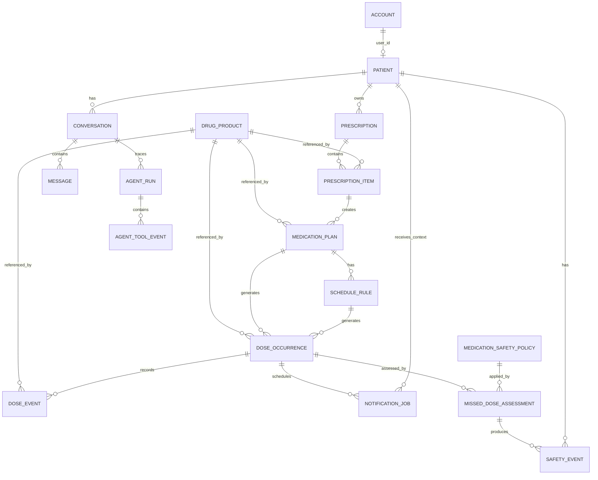
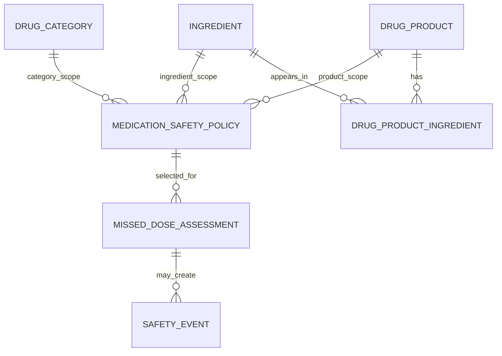
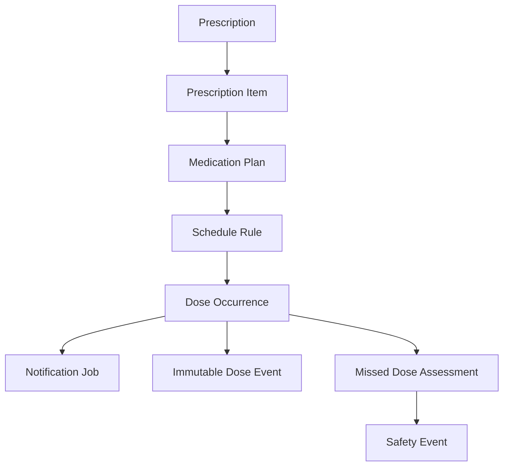
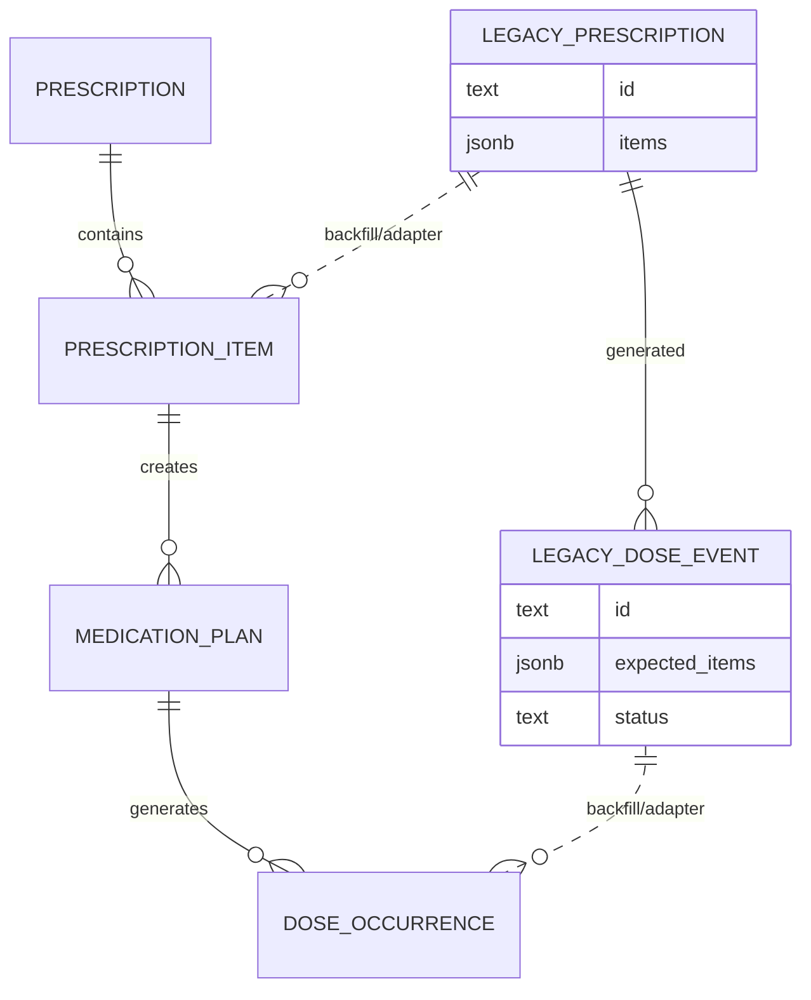

# 04 ERD

Scope: Database Architecture V2, Phase DB-2. This ERD is a target design artifact only. It does not create or modify database schema.

## 1. Core ERD



## 2. Safety Policy ERD

`medication_safety_policy.scope_id` is polymorphic by design. The resolver chooses the most specific matching policy.



Resolution priority:

```text
DRUG_PRODUCT policy
  -> INGREDIENT policy
  -> CATEGORY fallback policy
  -> UNKNOWN / safe fallback
```

Category fallback must never override drug-product or ingredient policy.

## 3. Dose Occurrence Granularity

Target:

```text
Patient takes 3 medicines at 08:00

UI group: 08:00
  - dose_occurrence A: drug 1, one dose
  - dose_occurrence B: drug 2, one dose
  - dose_occurrence C: drug 3, one dose
```

ERD consequence:

- `dose_occurrence` belongs to one `medication_plan`.
- `dose_occurrence` references one `drug_product_id` when known.
- Grouping by same local time is a projection, not a persisted replacement for occurrences.

## 4. Prescription To Schedule Flow



Important split:

- `prescription_item` records what was prescribed.
- `medication_plan` records the actionable patient plan.
- `schedule_rule` records generation logic.
- `dose_occurrence` records current expected dose state.
- `dose_event` records immutable behavior/history.

## 5. Legacy Compatibility ERD

During additive migration:



Compatibility rules:

- Legacy `prescription.items[]` maps to `prescription_item`.
- Legacy grouped `dose_event.expected_items[]` maps to multiple `dose_occurrence` rows.
- Public `drug_id` remains `legacy_drug_id`.
- New internal references use nullable `drug_product_id` until backfill is complete.

## 6. Cardinality Notes

Patient:

- One `account` may link to one `patient` for patient users.
- One `patient` has many prescriptions, medication plans, occurrences, notifications, safety events, conversations.

Prescription:

- One `prescription` has many `prescription_item` rows.
- One `prescription_item` generally creates one `medication_plan`, but future revisions may allow multiple plans if a medicine has split phases.

Medication scheduling:

- One `medication_plan` has one or more `schedule_rule` rows.
- One `schedule_rule` generates many `dose_occurrence` rows.
- One `dose_occurrence` has many immutable `dose_event` rows.

Notification:

- One `dose_occurrence` may have many notification jobs.
- A notification job may be unrelated to a dose only for general safety alerts.

Safety:

- One `missed_dose_assessment` references at most one selected policy.
- One assessment may create zero or more safety events.
- One safety event may reference a conversation, dose occurrence, assessment, and drug product, but should be understandable even if some references are absent.

Agent:

- One conversation has many messages.
- One conversation may have many agent runs.
- One agent run has many agent tool events.

## 7. Delete And Retention Model

Recommended:

- No hard delete for prescriptions, prescription items, medication plans, dose occurrences, dose events, safety events, assessments, or audit logs.
- Use lifecycle statuses such as `CANCELLED`, `SUPERSEDED`, `ARCHIVED`.
- Medication Safety Policy versions should be retired by `valid_to` or `review_status=RETIRED`, not overwritten.

## 8. ERD Risks

- The physical table name `dose_event` collides with the current MVP table. Migration design must handle this explicitly.
- Polymorphic `medication_safety_policy.scope_id` is flexible but cannot enforce all FKs at DB level unless separate scoped tables or nullable scope columns are used.
- Compatibility UI grouping must be implemented carefully so grouped display does not leak back into domain storage.

