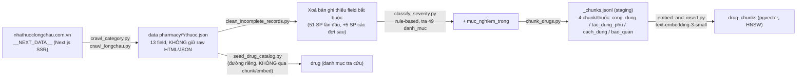

# Drug data overview — nguồn, pipeline, schema thực tế (rà lại 2026-08-16)

> Tài liệu này rà lại toàn bộ `data pharmacy/`, `crawler/`, `scripts/`, `backend/db/models.py`,
> `migrations/`, và lịch sử git để trả lời chính xác dữ liệu thuốc hiện tại đến từ đâu, đã qua
> pipeline nào, và đang nằm ở đâu trong DB — vì `data pharmacy/README.md` và một phần
> `chat-bot-build/chatbot-rag-design.md` đang mô tả **không khớp với dữ liệu thật trong repo**.

## 0. Kết luận nhanh (đọc cái này trước)

- **Điểm mơ hồ mà đề bài hỏi — pipeline nào thực sự sinh ra dataset hiện tại — đã có câu trả lời
  dứt khoát:** toàn bộ 3562 bản ghi hiện có trong `data pharmacy/*/thuoc.json` đều đến từ
  **crawl tự động** (`crawler/crawl_category.py` + `crawler/crawl_longchau.py`, nguồn
  nhathuoclongchau.com.vn), **không có bản ghi thủ công nào còn tồn tại trong repo**.
- `data pharmacy/README.md` ("Kho dữ liệu thuốc **tự tổng hợp (không crawl)**...") và quy trình
  `raw.md` → `scripts/map_drug_data.py` mà nó mô tả là **tài liệu/công cụ chết** — từng đúng đúng 1
  lần, cho đúng 1 danh mục thử nghiệm ("Thuốc cảm lạnh, ho", commit `b24fca0`, 2026-08-03), rồi
  chính danh mục đó **bị xoá** trong commit crawl thật đầu tiên (`559b244`, 2026-08-04) và chưa bao
  giờ quay lại. README này cần được viết lại hoặc xoá — xem mục 1.4.
- Dữ liệu **không giữ raw HTML/JSON gốc, không giữ URL nguồn theo từng thuốc**. Không có field
  `source`/`url`/`crawled_at` nào trong `thuoc.json` — xem mục 1.3 và 1.5.
- Có sự **lệch số liệu giữa 2 nguồn về việc đã embed bao nhiêu thuốc** (comment trong code nói
  226/3562, ghi nhớ vận hành DB nói ~14.447 dòng `drug_chunks` tức gần như đủ 3562×~4) — xem mục
  3.3, cần verify lại DB thật trước khi dùng số nào.

---

## 1. Nguồn dữ liệu gốc

### 1.1. Nguồn duy nhất: nhathuoclongchau.com.vn, crawl bằng `requests` + `BeautifulSoup`

- **Không dùng Playwright/browser giả lập.** Trang sản phẩm và trang danh mục của
  nhathuoclongchau.com.vn là Next.js SSR — response HTML đầu tiên của 1 `GET` thuần đã nhúng sẵn
  toàn bộ dữ liệu sản phẩm trong thẻ `<script id="__NEXT_DATA__" type="application/json">`. Script
  chỉ cần `requests.get()` rồi `BeautifulSoup` tìm thẻ đó, `json.loads()` — không có bước gọi API
  riêng nào bị dò ngược, cũng không cần render JS ([`crawler/crawl_longchau.py`](../crawler/crawl_longchau.py),
  chi tiết lý do kỹ thuật + toàn bộ log lỗi/fix ở [`crawler/report.md`](../crawler/report.md)).
- 2 script:
  - [`crawler/crawl_longchau.py`](../crawler/crawl_longchau.py) — crawl **1 trang sản phẩm** ra 1 JSON theo schema.
  - [`crawler/crawl_category.py`](../crawler/crawl_category.py) — crawl **cả 1 danh mục**, dùng lại
    `extract_fields()` của file trên. Vì trang danh mục SSR chỉ nhúng sẵn tối đa ~12 sản phẩm/lần
    gọi, script hợp kết quả từ nhiều giá trị filter (thương hiệu, nước SX, chỉ định...) để phủ gần
    hết danh mục — **không đảm bảo phủ 100%**, tự log cảnh báo khi thiếu (xem `report.md` mục 6-7).
- Không cần API key, có `User-Agent` giả trình duyệt thật, có delay ngẫu nhiên 1.5–3s +
  checkpoint pause 8–15s mỗi 20 request để giảm rủi ro bị chặn.

### 1.2. Còn giữ raw HTML/JSON không? → **Không.**

Cả 2 script đều **parse trực tiếp rồi ghi thẳng ra `thuoc.json` đã map field** — không có bước
lưu `__NEXT_DATA__` gốc hay HTML response ra đĩa/log. Nghĩa là: nếu Long Châu đổi cấu trúc trang
hoặc gỡ sản phẩm, **không có cách nào review lại đúng nguyên văn đã crawl** ngoài field đã map sẵn
trong `thuoc.json`. Đây là rủi ro tái tạo (reproducibility) thật, không phải giả định.

### 1.3. Có URL nguồn theo từng thuốc không? → **Không.**

- `crawl_category.py` gọi từng trang chi tiết qua `url = f"{BASE_URL}/{item['slug']}"`, dùng
  đúng `slug` mà site trả về trong danh sách sản phẩm — nhưng **giá trị `slug` này không được ghi
  vào `thuoc.json`**.
- Field `id` trong output (dùng làm khoá chính `drug.id`/`drug_chunks.drug_id`) được **tự sinh lại
  từ `product.name`** qua `slugify()` ([`crawler/crawl_longchau.py:326`](../crawler/crawl_longchau.py#L326)) —
  đây là 1 slug khác, không phải path thật trên site (vd trang mẫu trong `report.md` có URL path
  `agiclovir-5-agimexpharm-30338.html` nhưng `id` sinh ra chỉ là `agiclovir-5...` không có hậu tố
  số `-30338`).
- Kết luận: **không thể tái tạo chính xác URL nguồn của 1 bản ghi cụ thể chỉ từ dữ liệu đang có** —
  chỉ đoán gần đúng bằng cách tự search lại tên thuốc trên site. Đây là gap trực tiếp với AC gốc
  của `TASK-001` (xem mục 1.5) và với ràng buộc domain `drug-knowledge` "không bao giờ trả thông
  tin không có `source`" (`specs/domains.md:43`) — trên thực tế `source` runtime hiện tại
  (`chatbot-rag-design.md` mục 3.1: `"tac_dung_phu — {ten_thuoc}"`) là **nhãn nội bộ trỏ về field
  nào của thuốc nào trong DB**, không phải link ngược ra trang gốc đã crawl.

### 1.4. Crawler/script nào thực sự tạo ra dataset — dựng lại theo lịch sử git

Đọc theo đúng thứ tự commit chạm `data pharmacy/*/thuoc.json` (`git log --diff-filter=A`):

| Ngày | Commit | Việc làm |
|---|---|---|
| 2026-08-03 | `b24fca0` | Tạo cấu trúc `data pharmacy/` + `scripts/map_drug_data.py` (workflow **thủ công**: gõ `raw.md` → script map field). Chỉ áp dụng cho 1 danh mục thử: "Thuốc cảm lạnh, ho". |
| 2026-08-04 | `41e5b13`, `0591496` | Viết `crawl_longchau.py` (1 trang) rồi `crawl_category.py` (cả danh mục) — chuyển hẳn sang crawl thật. |
| 2026-08-04 | `7ca766e`, `1ac6193` | Crawl "Thuốc kháng sinh", "Thuốc điều trị ung thư", "Thuốc tim mạch và máu". |
| 2026-08-04 | `559b244` (#4) | Merge kết quả crawl 4 danh mục đầu (~1470 SP) vào main. **Cùng lúc xoá "Thuốc cảm lạnh, ho"** — danh mục thủ công duy nhất biến mất từ đây, không quay lại. |
| 2026-08-04 | `1c80371` | `clean_incomplete_records.py` chạy lần đầu — xoá 51 SP thiếu field bắt buộc. |
| 2026-08-04→08-05 | `9809a9b`, `f5dfa4c`, `500df89`, `0a690e4` | Crawl tiếp 6 danh mục còn lại ("Thuốc tiêu hoá và gan mật", "Thuốc mắt tai mũi họng", "Thuốc thần kinh", "Thuốc tiêm chích và dịch truyền", "Thuốc trị tiểu đường", "Thuốc bổ và vitamin", "Thuốc da liễu"), song song sửa lỗi phân loại `duong_dung`. |
| 2026-08-04 | `880d874` | `scripts/classify_severity.py` — gán `muc_nghiem_trong` rule-based theo `danh_muc`. |
| 2026-08-08 | `1374c6d` | `scripts/chunk_drugs.py` + `scripts/embed_and_insert.py` — Phase 2-3 (chunking + embedding). |
| 2026-08-09 | `51c8b7b` (#7) | Merge toàn bộ vào main cùng backend. |

**Vậy: `scripts/map_drug_data.py` và quy trình `raw.md` trong `data pharmacy/README.md` mô tả một
workflow đã bị bỏ hoàn toàn từ 2026-08-04 — không map bất kỳ bản ghi nào đang tồn tại trong repo
hôm nay.** Pipeline thật là **crawl → clean → classify → chunk → embed** (chi tiết mục 4).

### 1.5. Bao nhiêu nguồn? Có review y khoa không?

- **1 nguồn duy nhất**: nhathuoclongchau.com.vn (1 nhà thuốc bán lẻ trực tuyến, không phải Dược thư
  Quốc gia / tờ HDSD gốc của nhà sản xuất / Bộ Y tế). Không có đối chiếu chéo giữa nhiều nguồn.
- **Không có chuyên gia y khoa/dược sĩ review** bất kỳ bản ghi nào — toàn bộ là parse tự động +
  1 bảng tra cứu rule-based cho riêng `muc_nghiem_trong` (do "Architect xác nhận 2026-08-04" theo
  comment trong `classify_severity.py`, không phải dược sĩ).
- Đây là gap trực tiếp với chính AC đã đặt ra trong
  [`tasks/TASK-001-thu-thap-du-lieu-thuoc.md`](../tasks/TASK-001-thu-thap-du-lieu-thuoc.md):
  task này yêu cầu mỗi bản ghi có "**nguồn trích dẫn (URL + ngày truy cập)**", "**bản ghi không có
  nguồn → không được commit**", "**rà tay ngẫu nhiên 10 bản ghi đối chiếu nguồn gốc**", và 1 script
  validate nối vào CI. **Không có mục nào trong số này được implement** — không có field ngày
  crawl/URL trong schema, không có bước rà tay nào được ghi lại, và `Makefile`/`.github/workflows/ci.yml`
  hiện không có bước `validate-data` nào cho `data pharmacy/`.

---

## 2. Data thực tế hiện tại

### 2.1. Quy mô thật (đếm trực tiếp từ file, 2026-08-16)

| File | Số thuốc |
|---|---:|
| `Thuốc bổ và vitamin/thuoc.json` | 316 |
| `Thuốc da liễu/thuoc.json` | 307 |
| `Thuốc kháng sinh/thuoc.json` | 425 |
| `Thuốc kháng virus/thuoc.json` | 79 |
| `Thuốc mắt, tai, mũi, họng/thuoc.json` | 188 |
| `Thuốc thần kinh/thuoc.json` | 348 |
| `Thuốc tim mạch và máu/thuoc.json` | 832 |
| `Thuốc tiêm chích và dịch truyền/thuoc.json` | 159 |
| `Thuốc tiêu hoá và gan mật/thuoc.json` | 625 |
| `Thuốc trị tiểu đường/thuoc.json` | 201 |
| `Thuốc điều trị ung thư/thuoc.json` | 82 |
| **Tổng** | **3562** (11 thư mục, 49 `danh_muc` chi tiết) |

`data pharmacy/_chunks.jsonl` (staging file, không phải nguồn sự thật — xem mục 4.3): 14.200 dòng
≈ 3.99 chunk/thuốc, khớp thiết kế "4 chunk/thuốc".

Không có `raw.md`/`raw.txt` nào còn tồn tại trong bất kỳ thư mục nào — `schema.json` và
`_template.json` vẫn còn nhưng chỉ dùng để validate cấu trúc, không phải nguồn nhập liệu thật.

### 2.2. Chất lượng dữ liệu — đo trực tiếp trên toàn bộ 3562 bản ghi

| Kiểm tra | Kết quả |
|---|---|
| Thiếu field bắt buộc (theo `schema.json`, trừ `thoi_diem_dung`) | **0** — `clean_incomplete_records.py` đã lọc sạch trước khi commit |
| `id` trùng nhau | **0** |
| `ten_thuoc` trùng chính xác | 1 cặp (2 bản ghi) — khác `id`/`danh_muc`, khả năng là 2 SKU/hàm lượng khác nhau cùng tên hiển thị |
| `thoi_diem_dung` không rỗng (đúng ra phải luôn rỗng theo thiết kế) | **0** — assertion trong `chunk_drugs.py` cũng tự kiểm tra lại điều này mỗi lần chạy |
| Placeholder template `"<...>"` còn sót trong data thật | **0** |
| `huong_dan_bao_quan` rỗng (field không bắt buộc) | 48/3562 (1.3%) |
| `luu_y_dac_biet` rỗng (mảng, không bắt buộc) | 7/3562 (0.2%) |

**Phân bố `duong_dung`** (2808 Uống / 319 Bôi ngoài da / 202 Tiêm / 109 Nhỏ mắt / 69 Tiêm truyền /
32 Xịt / 11 Nhỏ tai / 10 Nhỏ mũi / 2 Ngậm) — không có giá trị rỗng nhờ nguyên tắc "không suy đoán,
để trống rồi loại bỏ ở bước clean" (xem `report.md` mục 8.3), nên phân bố này chỉ phản ánh
**những gì đã suy luận được chắc chắn từ `dang_thuoc`**, không phải phân bố thật của mọi thuốc từng
crawl (một số bị loại hẳn ở bước `clean_incomplete_records.py` vì không suy ra được `duong_dung`).

**Phân bố `muc_nghiem_trong`**: Nhẹ 822 / Trung bình 1352 / Nguy hiểm 1388 — thiên về "Nguy hiểm"
theo đúng chủ đích của BR-3.2/BR-3.6 (không chắc thì nâng lên, không hạ xuống).

### 2.3. Bản ghi mẫu thật (rút gọn từ `Thuốc kháng sinh/thuoc.json`)

```json
{
  "ten_thuoc": "Acigmentin 625 MINH HẢI 2x7",
  "ham_luong": "Amoxicillin 500mg; Clavulanic acid 125mg",
  "dang_thuoc": "Viên nén bao phim",
  "tong_so_luong": "Hộp 2 Vỉ x 7 Viên",
  "tac_dung": "Thuốc Acigmentin 625mg được chỉ định dùng trong các trường hợp sau: ...",
  "tac_dung_phu": "Khi sử dụng thuốc Acigmentin 625, bạn có thể gặp các tác dụng không mong muốn (ADR)...",
  "huong_dan_su_dung": "Thuốc dùng đường uống, nên uống thuốc vào đầu bữa ăn...",
  "lieu_dung": "Dùng cho người lớn và trẻ em ≥ 12 tuổi: Nhiễm khuẩn nhẹ và vừa: 1 viên cách 12 giờ/1 lần...",
  "duong_dung": "Uống",
  "thoi_diem_dung": "",
  "huong_dan_bao_quan": "Nhiệt độ dưới 30°C. Nơi khô mát, tránh ánh sáng. Để xa tầm tay trẻ em.",
  "luu_y_dac_biet": [
    "Chống chỉ định: ...",
    "Thận trọng khi sử dụng: ...",
    "Khả năng lái xe và vận hành máy móc: Chưa có tài liệu ghi nhận.",
    "Thời kỳ mang thai: ...",
    "Thời kỳ cho con bú: ...",
    "Tương tác thuốc: ...",
    "Đối tượng cần thận trọng: Suy gan thận",
    "Đối tượng cần thận trọng: Phụ nữ có thai",
    "Đối tượng cần thận trọng: Phụ nữ cho con bú"
  ],
  "id": "acigmentin-625-minh-hai-2x7",
  "danh_muc": "Thuốc kháng sinh",
  "muc_nghiem_trong": "Trung bình"
}
```

Nhận xét từ bản ghi thật này (đại diện cho phần lớn corpus):
- Nội dung **rất dài, nguyên văn tờ HDSD** (không tóm tắt) — `tac_dung_phu` và `luu_y_dac_biet` của
  các thuốc phối hợp nhiều hoạt chất có thể vượt 8000 token, buộc `chunk_drugs.py` phải tách 1
  `field_group` thành nhiều chunk (xem mục 4.3).
- `luu_y_dac_biet` là mảng nhiều mục hỗn hợp (chống chỉ định, thận trọng, thai kỳ, tương tác thuốc,
  đối tượng đặc biệt...) — **không tách bảng tương tác thuốc riêng**, tất cả nằm chung 1 field dạng
  văn bản tự do → không truy vấn được kiểu "thuốc A có tương tác với thuốc B không" bằng structured
  query, chỉ có thể qua RAG semantic search.
- `thoi_diem_dung` luôn rỗng — đúng thiết kế, xem mục 5.

Ví dụ dòng `_chunks.jsonl` tương ứng 1 chunk (`field_group = "cong_dung"`) sau khi build:

```json
{"drug_id": "3b-agi-neurin-agimexpharm-10x10", "ten_thuoc": "3b Agi-neurin Agimexpharm 10x10", "danh_muc": "Thuốc bổ", "muc_nghiem_trong": "Nhẹ", "field_group": "cong_dung", "noi_dung": "Thuốc: 3b Agi-neurin Agimexpharm 10x10 (Vitamin B1... 125mg, Viên nén bao phim) — Thuốc bổ\n\nThuốc 3B Agi-Neurin chỉ định điều trị trong các trường hợp sau: ..."}
```

---

## 3. Database schema hiện tại

2 bảng liên quan trực tiếp tới dữ liệu thuốc, **cố ý tách riêng** (comment trong
[`backend/db/models.py`](../backend/db/models.py)):

### 3.1. `drug_chunks` — sản phẩm RAG (migration `0001_initial_schema.py`)

1 dòng = 1 chunk (4 chunk/thuốc, có thể nhiều hơn nếu 1 `field_group` bị tách do quá dài).

| Cột | Kiểu | Ghi chú |
|---|---|---|
| `id` | `String` PK | UUID tự sinh |
| `drug_id` | `String`, index | = `thuoc.id` trong `data pharmacy/` |
| `ten_thuoc` | `String` | nguyên văn, chưa unaccent |
| `danh_muc` | `String` | |
| `muc_nghiem_trong` | `String` | Nhẹ\|Trung bình\|Nguy hiểm |
| `field_group` | `String` | cong_dung\|tac_dung_phu\|cach_dung\|bao_quan |
| `noi_dung` | `Text` | text gốc chưa embed, trả về nguyên văn cho `DrugInfoDTO.noi_dung` |
| `noi_dung_unaccent`, `ten_thuoc_unaccent` | `Text` | build bằng `unaccent()` **trong SQL lúc insert**, không build ở Python — để đảm bảo cùng logic bỏ dấu với lúc query |
| `embedding` | `Vector(1536)` (pgvector) | model `text-embedding-3-small` |
| `created_at` | `DateTime(timezone=True)` | |

Index: `(drug_id)`, `(drug_id, field_group)`, **HNSW** trên `embedding` (`vector_cosine_ops`), 2
**GIN trigram** (`pg_trgm`) trên `noi_dung_unaccent` và `ten_thuoc_unaccent` — phục vụ hybrid
search (vector + lexical, hợp nhất bằng RRF, xem `backend/services/retrieval.py`).
Extension bật kèm trong cùng migration: `vector`, `pg_trgm`, `unaccent`.

### 3.2. `drug` — danh mục tra cứu (migration `0014b_drug_catalog.py`, thêm 2026-08-12)

1 dòng = 1 thuốc, dùng để **bác sĩ tra cứu lúc kê đơn** (không phải RAG). Tách riêng khỏi
`drug_chunks` vì 2 lý do ghi rõ trong code: (1) `drug_chunks` lặp 4 dòng/thuốc, thêm cột structured
vào đó sẽ lặp 4 lần cùng giá trị; (2) `drug_chunks` chỉ chứa thuốc **đã embed**, còn danh mục kê
đơn cần đủ **cả 3562 thuốc** ngay cả khi embedding chưa chạy xong.

| Cột | Kiểu | Ghi chú |
|---|---|---|
| `id` | `String` PK | |
| `ten_thuoc`, `ten_thuoc_unaccent` | `String`/`Text` | |
| `dang_thuoc` | `String`, NOT NULL | **field quan trọng nhất bảng này** — đầu vào của `backend/services/photo_verification/dosage_form.py`, quyết định 1 liều có xác minh được bằng ảnh hay không |
| `duong_dung` | `String`, NOT NULL | |
| `ham_luong`, `tong_so_luong`, `danh_muc`, `muc_nghiem_trong` | nullable | |
| `created_at` | | |

Index: `ten_thuoc`, GIN trigram trên `ten_thuoc_unaccent`, index trên `dang_thuoc`.

Nạp bằng [`scripts/seed_drug_catalog.py`](../scripts/seed_drug_catalog.py) — đọc thẳng
`data pharmacy/**/*.json`, xoá sạch bảng `drug` rồi nạp lại (idempotent, an toàn vì bảng này chỉ là
**bản sao** của `data pharmacy/`). Lý do phải chạy script riêng thay vì để migration tự làm:
`data pharmacy/` bị `.railwayignore` loại khỏi gói deploy (~32MB), server production **không có
file nguồn** — dữ liệu vào production chỉ qua đường DB.

### 3.3. ⚠️ Số liệu embed hiện tại — 2 nguồn không khớp, cần verify lại

- Comment trong `backend/db/models.py:87` (viết trong migration `0014b`, 2026-08-12): *"drug_chunks
  chỉ chứa thuốc ĐÃ EMBED (hiện **226/3562**)"*.
- Ghi nhớ vận hành DB (2026-08-11, xem `memory/p067-db-migration-status.md`) sau khi restore dữ
  liệu lên Railway: `drug_chunks` có **14.447 dòng** — gần khớp 3562×4 ≈ 14.248, tức gần như **toàn
  bộ** đã embed.
- 2 mốc thời gian rất gần nhau (11/8 vs 12/8) nhưng kết luận trái ngược. Có thể 1 trong 2 là snapshot
  của 1 DB khác (dev-local chưa embed xong vs Railway đã restore dữ liệu embed xong từ trước), nhưng
  tài liệu không nói rõ. **Trước khi dựa vào bảng `drug_chunks` cho bất kỳ việc gì (demo, eval), nên
  chạy lại `SELECT count(DISTINCT drug_id) FROM drug_chunks;` trên DB thật đang dùng** thay vì tin
  theo 1 trong 2 con số trên.

---

## 4. Pipeline tạo dữ liệu — Source → Raw → Clean → Normalize → Chunk → Embed → PostgreSQL



Điểm cần lưu ý về pipeline (không chỉ liệt kê bước, mà các ràng buộc thật đang code hoá):

- **Bước Raw = Clean gộp làm một.** Không có giai đoạn "raw" tách biệt được lưu lại — `extract_fields()`
  trong crawler vừa lấy dữ liệu vừa map thẳng vào field schema (tách section theo heading `<h3>`,
  lọc bỏ Dược lực học/Dược động học khỏi `tac_dung`...). Không có bước review nào chen giữa crawl và
  ghi file.
- **`clean_incomplete_records.py` không suy đoán/backfill** — bản ghi thiếu field bắt buộc bị **xoá
  hẳn**, không đoán giá trị (cùng nguyên tắc với việc bỏ mặc định "Uống" cho `duong_dung`, xem
  `report.md` mục 8.3). Log các bản ghi đã xoá nằm ở `data pharmacy/_removed_incomplete_log.txt`
  (128 dòng tính đến nay).
- **`_chunks.jsonl` chỉ là file staging để xem trước/debug**, không phải nguồn sự thật — script
  embed (`embed_and_insert.py`) **đọc lại trực tiếp từ `data pharmacy/*/thuoc.json` qua hàm
  `iter_all_chunks()`**, không phụ thuộc file `.jsonl` có tồn tại/mới hay không.
- **`thoi_diem_dung` có assertion runtime** trong `chunk_drugs.py`: mỗi lần build chunk, script tự
  kiểm tra field này không lọt vào bất kỳ `noi_dung` nào, in `[LOI NGHIEM TRONG]` nếu phát hiện —
  đây là ràng buộc an toàn dữ liệu duy nhất được code hoá thành assertion tự động trong toàn bộ
  pipeline (mọi bước khác chỉ log cảnh báo, không có test/assertion chặn).
- **`drug` (danh mục) và `drug_chunks` (RAG) là 2 đường nạp độc lập**, cùng đọc từ
  `data pharmacy/` nhưng không đi qua nhau — `seed_drug_catalog.py` không cần chunk/embed đã chạy
  xong, nên 2 bảng có thể lệch tiến độ (đúng như mục 3.3 đang cho thấy).
- **Chi phí embedding**: `embed_and_insert.py` ước tính bằng `text-embedding-3-small`, giá tham
  khảo $0.02/1M token (giá cứng trong code, tự ghi chú "cần tự kiểm tra lại"), batch 100 chunk/lần
  gọi API.

---

## 5. Ý nghĩa business của từng field

Nguồn của mỗi field, đối chiếu `schema.json` + `crawler/crawl_longchau.py::extract_fields()`:

| Field | Nguồn thật | Cách sinh |
|---|---|---|
| `ten_thuoc` | Nguyên văn từ nguồn (`product.name`) | Code chuẩn hoá lại cách viết hoa (`normalize_product_name`) — KHÔNG phải LLM, rule tách theo token có chữ số/toàn chữ hoa ngắn |
| `ham_luong` | Nguyên văn (`product.ingredient[]`) | Code ghép `tên hoạt chất + hàm lượng`, tự lọc bỏ tá dược bằng regex |
| `dang_thuoc` | Nguyên văn (`product.dosageForm`) | Không xử lý gì thêm |
| `tong_so_luong` | Nguyên văn (`product.specification`) | Không xử lý gì thêm |
| `tac_dung` | Nguyên văn, đã cắt bớt | Code tách phần "Chỉ định" khỏi đoạn `usage` gộp (bỏ Dược lực học/Dược động học) — rule dựa theo heading, không LLM |
| `tac_dung_phu` | Nguyên văn (`content.adverseEffect`) | Chỉ strip HTML, không cắt |
| `huong_dan_su_dung`, `lieu_dung` | Nguyên văn, tách theo heading "Cách dùng"/"Liều dùng" trong `content.dosage` | Rule-based; nếu trang không có heading, dồn hết vào `huong_dan_su_dung`, để `lieu_dung` trống (không LLM tóm tắt) |
| `duong_dung` | **Do code tự suy luận**, không lấy trực tiếp từ site | Bảng từ khoá cố định `ROUTE_KEYWORDS`/`ORAL_KEYWORDS` tra trên `dang_thuoc` — KHÔNG mặc định "Uống", để trống nếu không khớp từ khoá nào (nguyên tắc an toàn, xem `report.md` mục 8.3) |
| `thoi_diem_dung` | **Không có nguồn nào ở bước này** | Luôn để `""` theo thiết kế — dữ liệu này thuộc về đơn thuốc bác sĩ kê cho **từng bệnh nhân**, lấy qua `PrescriptionDTO.items[].thoi_diem_dung` lúc runtime, không phải kiến thức chung của thuốc (xem [[thoi_diem_dung_data_source]], `chatbot-rag-design.md` mục 3.1) |
| `muc_nghiem_trong` | **Do team tự gán** (rule-based, không phải nguồn/LLM) | Tra bảng cố định `SEVERITY_BY_DANH_MUC` trong `scripts/classify_severity.py` theo `danh_muc` — do "Architect xác nhận 2026-08-04" dựa trên đặc điểm lâm sàng chung của tiểu mục, **không phải đánh giá per-thuốc, không phải chuyên gia y khoa review**. Chỉ là prior/fallback (BR-3.6), RAG runtime vẫn có thể đánh giá khác đi theo `tac_dung` thật của từng thuốc |
| `huong_dan_bao_quan` | Nguyên văn (`content.preservation`) | Strip HTML |
| `luu_y_dac_biet` | Nguyên văn, gộp nhiều mục | Tách `content.careful` theo `<h3>` (chống chỉ định, thận trọng, thai kỳ, cho con bú, tương tác thuốc...) + `product.warning[]`, mỗi mục thành 1 phần tử mảng có nhãn |
| `id` | **Do code sinh** | `slugify(product.name)`, chống trùng bằng hậu tố `-2`, `-3`... trong phạm vi 1 lần crawl |
| `danh_muc` | Nguyên văn (`product.categories[-1].name`, fallback breadcrumb) | Không phải tên thư mục cha — 1 thư mục (`Thuốc tim mạch và máu`) có thể gộp nhiều `danh_muc` con (`Thuốc chống đông máu`, `Thuốc trị mỡ máu`...); đây cũng là khoá tra cứu `muc_nghiem_trong` |

Không có field nào trong dataset hiện tại do **LLM sinh** — toàn bộ là parse rule-based/tách theo
cấu trúc HTML có sẵn của site, kể cả `muc_nghiem_trong` (tra bảng tĩnh, không gọi model).

---

## 6. Phạm vi sản phẩm — dữ liệu hiện tại phục vụ được gì

Theo `specs/product-vision.md` §4, phạm vi MVP **rộng hơn** "chỉ nhắc thuốc + hỏi thông tin thuốc":

**Trong phạm vi V1 (đã có backend cho từng phần):**
- Bác sĩ tạo phác đồ (kê đơn) qua form — cần đúng `dang_thuoc` để xác minh liều bằng ảnh
  → chính là lý do bảng `drug` tồn tại tách riêng (mục 3.2).
- Nhắc lịch uống thuốc theo phác đồ đã duyệt, xác nhận bằng ảnh (đếm viên) hoặc hội thoại tự nhiên.
- Đánh giá mức nghiêm trọng theo ngữ cảnh thuốc bằng RAG (không dùng rule cứng runtime —
  `muc_nghiem_trong` trong data chỉ là fallback).
- Safety layer phát hiện triệu chứng nguy hiểm, escalation 3 mức tới người thân/bác sĩ (đã có
  bảng `escalation`, `caregiver_link`).
- Dashboard tuân thủ cho bác sĩ.

**Ngoài phạm vi V1 (ghi rõ trong `product-vision.md` §4 "Ngoài phạm vi"):**
- Không tích hợp EMR/HIS thật — đơn thuốc nhập qua form mô phỏng, không OCR đơn giấy.
- Agent không kê đơn/đổi thuốc/đổi liều/chẩn đoán.
- Chưa làm ở v1: đồng bộ thiết bị đo, đặt thuốc, thanh toán, tele-consult, đa ngôn ngữ.
- **Không có bảng tương tác thuốc–thuốc (drug-drug interaction) có cấu trúc** — thông tin tương tác
  hiện chỉ nằm lẫn trong văn bản tự do của `luu_y_dac_biet` (xem mục 2.3), không truy vấn được như
  dữ liệu quan hệ. Nếu muốn làm tính năng "thuốc A và B có tương tác không" ở sprint sau, đây là
  chỗ schema V2 cần mở thêm bảng riêng, không nên cố suy ra từ text tự do của `luu_y_dac_biet`.
- **Không có dữ liệu chống chỉ định/bệnh nền/dị ứng theo hồ sơ bệnh nhân** có cấu trúc — chỉ có
  field `patient` với `health fields` chung chung (migration `0021`), không link được tới
  `contraindication` cụ thể của từng thuốc.

**Gợi ý cho schema V2 (để không tự khoá đường mở rộng):** nếu sau này cần tương tác thuốc/chống chỉ
định làm dữ liệu có cấu trúc (không chỉ RAG semantic), nên tách thành bảng quan hệ riêng
(`drug_interaction(drug_id_a, drug_id_b, severity, description)`,
`drug_contraindication(drug_id, condition_code, description)`) thay vì mở rộng thêm cột trong
`drug`/`drug_chunks` — giữ đúng nguyên tắc đã áp dụng cho `drug` vs `drug_chunks` (mục 3.2): bảng
danh mục structured tách khỏi bảng nội dung tự do dùng cho RAG.

---

## 7. Yêu cầu về nguồn và chất lượng y khoa

- **Hiện trạng thật**: dữ liệu dùng cho demo/đồ án (MVP 5 tuần, `product-vision.md` §6), **không**
  có bước chuyên gia y khoa/dược sĩ review, **không** verify chéo với nguồn thứ 2. Chỉ có 1 lớp
  kiểm tra tự động (đủ field bắt buộc theo schema), không kiểm tra **đúng về mặt y khoa**.
- **Không có provenance per-record** (mục 1.3) — nghĩa là hiện tại **không thể** trả lời "câu trả
  lời này truy ngược về đúng URL/thời điểm crawl nào" ở mức từng bản ghi, dù kiến trúc runtime
  (`chatbot-rag-design.md` mục 5, `DrugInfoDTO.source`) đã thiết kế sẵn chỗ để trả `source` — chỉ
  là `source` đó trỏ về **field nào của thuốc nào trong DB nội bộ**, không trỏ ra được trang gốc.
- **Việc đã chấp nhận dữ liệu chưa verified**: có, ở mức thực tế đang triển khai — `clean_incomplete_records.py`
  chỉ đảm bảo *đủ field*, không đảm bảo *đúng nội dung y khoa*. Business rule đang bù lại rủi ro này
  bằng nguyên tắc "an toàn trước" (BR-3.2/BR-3.6: không chắc → nâng mức nghiêm trọng, không hạ) và
  BR-7.3 (agent không khẳng định thông tin thuốc khi không có nguồn RAG), chứ không phải bằng cách
  đảm bảo dữ liệu đầu vào đã đúng.
- **Kết luận cho việc quyết định mức độ nghiêm ngặt provenance/version/review cần thêm**: nếu mục
  tiêu vẫn là demo/đồ án, mức hiện tại (crawl 1 nguồn + rule-based severity + không review y khoa)
  có thể chấp nhận được **miễn là công bố rõ giới hạn này** (điều mà `data pharmacy/README.md`
  hiện tại đang làm sai — nó nói ngược lại, rằng dữ liệu "tự tổng hợp không crawl"). Nếu hướng tới
  sản phẩm thật, việc cần làm trước tiên không phải là mở rộng field, mà là: (1) lưu lại URL + ngày
  crawl thật per-record, (2) có ít nhất 1 vòng rà tay/dược sĩ trên mẫu ngẫu nhiên như AC gốc của
  `TASK-001` đã yêu cầu nhưng chưa từng thực hiện, (3) sửa `data pharmacy/README.md` cho khớp thực
  tế để người sau không hiểu nhầm nguồn dữ liệu.

---

## Phụ lục — các file cần đọc thêm nếu muốn đào sâu

- Pipeline & lịch sử lỗi crawler: [`crawler/report.md`](../crawler/report.md)
- Thiết kế RAG đầy đủ (chunking, hybrid retrieval, DTO): [`chat-bot-build/chatbot-rag-design.md`](../chat-bot-build/chatbot-rag-design.md)
- Business rules liên quan (`BR-3.x`, `BR-7.x`): [`specs/business-rules.md`](../specs/business-rules.md)
- AC gốc chưa hoàn thành của việc thu thập dữ liệu: [`tasks/TASK-001-thu-thap-du-lieu-thuoc.md`](../tasks/TASK-001-thu-thap-du-lieu-thuoc.md)
- Migration liên quan: [`migrations/versions/0001_initial_schema.py`](../migrations/versions/0001_initial_schema.py) (drug_chunks), [`migrations/versions/0014b_drug_catalog.py`](../migrations/versions/0014b_drug_catalog.py) (drug)
