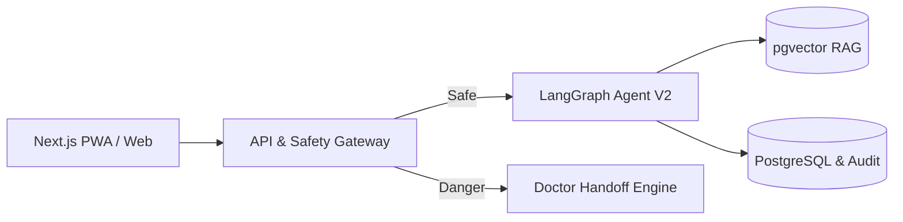

# 🎯 Pitch Deck Demo Day — Team P-067 (Capy Medi / VMEC-04)

> **Tài liệu Kịch bản & Dàn ý 10 Slide Thuyết trình:** Chuẩn hóa theo hướng dẫn của Ban Tổ Chức AI20K (Thời lượng trình bày: **10 phút** / 1 phút mỗi slide).

🔗 **Link Slide Thuyết trình Trực tuyến (Canva):** [**C3 - T067 - DictatorCapybara (Canva Link)**](https://canva.link/ilknefaktrieh91)

---

## 📑 Dàn ý Chi tiết 10 Slides Thuyết trình

---

### 🌟 Slide 1: Tiêu đề & Giới thiệu Đội thi (Title & Team)
- **Thời lượng:** 60 giây
- **Tiêu đề Slide:** **Capy Medi (VMEC-04) — AI Agent Nhắc Thuốc & Theo Dõi Tuân Thủ Điều Trị**
- **Thông điệp cốt lõi:** *"Khép kín vòng lặp chăm sóc giữa Bác sĩ và Bệnh nhân thông qua Trí tuệ nhân tạo Đa phương thức & Kiến trúc An toàn Fail-safe."*
- **Thành phần hiển thị:**
  - Logo sản phẩm **Capy Medi** (Biểu tượng chú chuột lang nước điềm tĩnh, tin cậy trong y tế).
  - Tên Đội: **Team P-067 (G14 - T067)** — VinUni AI20K Build Phase Cohort 3.
  - 4 Thành viên: Nguyễn Minh Đạt (Lead), Nguyễn Hải Yến (PM/FE), Phạm Thành Đạt (AI/QA), Trương Quốc Trường (Tech Lead).
- **Lời trình bày gợi ý (Speaker Script):**
  > "Kính chào Ban giám khảo và toàn thể hội trường. Chúng tôi là Team P-067. Hôm nay, chúng tôi tự hào mang đến **Capy Medi** — giải pháp AI Agent giám sát tuân thủ điều trị và nhắc thuốc thông minh dành cho bệnh nhân mãn tính. Mục tiêu của Capy Medi là biến việc uống thuốc mỗi ngày từ một gánh nặng tâm lý trở thành một hành trình an tâm, có bằng chứng khách quan gửi tới bác sĩ."

---

### ⚠️ Slide 2: Vấn đề Thực tế (Clinical Pain Point)
- **Thời lượng:** 60 giây
- **Tiêu đề Slide:** **Bác sĩ ra quyết định lâm sàng sai lệch vì thiếu dữ liệu tuân thủ thực tế**
- **Nội dung hiển thị:**
  - **3 Nỗi đau chính (3 Pain Points):**
    1. *Bệnh nhân cao tuổi đa bệnh lý:* Uống 5-10 loại thuốc mỗi ngày, dễ quên liều, uống sai giờ hoặc tự ý bỏ ngang khi thấy đỡ.
    2. *Bác sĩ "mù thông tin" giữa 2 lần khám:* Buộc phải tin vào lời kể chủ quan của người bệnh, dẫn tới nguy cơ tăng liều hoặc đổi phác đồ sai lầm.
    3. *Hạn chế của ứng dụng báo thức truyền thống:* Chỉ gửi thông báo một chiều, không kiểm chứng được thuốc đã thực sự được uống hay chưa.
  - **Con số dẫn chứng:** Trên 50% bệnh nhân tim mạch/tiểu đường không tuân thủ đúng phác đồ sau 6 tháng điều trị ngoại trú.
- **Lời trình bày gợi ý:**
  > "Vấn đề lớn nhất trong điều trị bệnh mãn tính không phải là bệnh nhân quên thuốc, mà là **bác sĩ phải ra quyết định lâm sàng dựa trên thông tin sai lệch**. Khi bệnh nhân không đỡ, bác sĩ tưởng phác đồ kém hiệu quả nên tăng liều, trong khi thực tế bệnh nhân chỉ mới uống 50% số liều. Các ứng dụng nhắc lịch hiện nay chỉ reo chuông một chiều và bị tắt đi ngay. Ngành y tế đang thiếu một cơ chế tạo bằng chứng tuân thủ khách quan."

---

### 💡 Slide 3: Giải pháp Capy Medi (Solution & Key Pillars)
- **Thời lượng:** 60 giây
- **Tiêu đề Slide:** **Vòng lặp Chăm sóc Khép kín: Bác sĩ ➔ AI Agent ➔ Bệnh nhân ➔ Người thân**
- **4 Trụ cột Giải pháp:**
  1. 📸 **Xác nhận bằng Ảnh (VLM Vision):** Chụp ảnh vỉ/viên thuốc, AI đếm số lượng và đối chiếu với đơn thuốc trước khi uống.
  2. 💬 **Hội thoại Tự nhiên (Agentic Dialog):** Nhận diện trạng thái qua giọng nói/chat tiếng Việt (*Đã uống / Trễ liều / Quên liều*).
  3. 🛡️ **RAG Y khoa có Nguồn:** Tra cứu tác dụng phụ và tương tác thuốc từ 3.500+ danh mục thuốc chuẩn hóa.
  4. 👨‍⚕️ **Human-in-the-loop (HITL):** Tự động phát hiện bất thường và chuyển tiếp (Handoff) ngay cho Bác sĩ phụ trách.
- **Lời trình bày gợi ý:**
  > "Capy Medi giải quyết triệt để bài toán này bằng vòng lặp chăm sóc 4 trụ cột. Bác sĩ kê đơn duyệt trên web; AI Agent chủ động nhắc lịch qua chat/voice; bệnh nhân chụp ảnh kiểm đếm trước khi uống; và mọi phản hồi về triệu chứng bất thường đều được RAG phân tích để tự động cảnh báo người thân qua Telegram và chuyển tiếp tới bác sĩ."

---

### 📱 Slide 4: Trải nghiệm Người dùng & Demo Luồng (Product Demo)
- **Thời lượng:** 60 giây
- **Tiêu đề Slide:** **Giao diện Đa nền tảng dành riêng cho từng đối tượng**
- **Nội dung hiển thị (3 Màn hình trực quan):**
  - **Bác sĩ (Desktop Web):** Dashboard theo dõi tỷ lệ tuân thủ (% Adherence), danh sách ca cần can thiệp (Doctor Queue).
  - **Bệnh nhân (Mobile PWA):** Lịch uống hôm nay (Today Schedule), khung chat AI hỗ trợ giọng nói (Voice), camera chụp ảnh thuốc 1 chạm.
  - **Người thân (Telegram Bot / Mobile):** Nhận tin nhắn cảnh báo tức thì khi người cao tuổi có dấu hiệu bỏ liều hoặc gặp tác dụng phụ.
- **Lời trình bày gợi ý:**
  > "Sản phẩm được thiết kế tối giản, thân thiện: Bệnh nhân lớn tuổi chỉ cần mở app nói 'Tôi uống thuốc rồi' hoặc chụp ảnh khay thuốc. Bác sĩ có dashboard trực quan hiển thị chính xác ngày nào bệnh nhân uống đúng, ngày nào trễ liều, giúp các buổi tái khám đạt hiệu quả lâm sàng cao nhất."

---

### 🏛️ Slide 5: Kiến trúc Hệ thống (System Architecture)
- **Thời lượng:** 60 giây
- **Tiêu đề Slide:** **Kiến trúc Phân tầng & Fail-closed Safety Gateway**
- **Sơ đồ Mermaid hiển thị:**

- **Điểm nhấn thiết kế:**
  - Lớp bảo vệ an toàn chạy độc lập trước khi gửi prompt vào LLM.
  - Cơ sở dữ liệu nhúng vector `pgvector` tích hợp sẵn trong PostgreSQL.
  - Nhật ký truy vết y khoa bất biến (*Immutable Audit Trail*).
- **Lời trình bày gợi ý:**
  > "Về mặt kiến trúc, hệ thống áp dụng nguyên tắc **Fail-closed**. Tầng Safety Gateway nằm độc lập để phân loại nguy cơ lâm sàng trước khi gọi AI. Nếu hệ thống gặp sự cố mạng hoặc bệnh nhân thông báo triệu chứng khẩn cấp, Gateway sẽ kích hoạt Handoff ngay lập tức, tuyệt đối không để mô hình ngôn ngữ tự do suy đoán."

---

### 🧠 Slide 6: Tiếp cận AI Đa phương thức (AI Approach & Multimodal)
- **Thời lượng:** 60 giây
- **Tiêu đề Slide:** **Bộ ba Trí tuệ Nhân tạo: LangGraph Agent + VLM + RAG Y khoa**
- **3 Công nghệ cốt lõi:**
  1. *LangGraph Agent V2:* Quản lý bộ nhớ ngắn hạn (Short-term Memory), giải quyết tham chiếu đại từ (Coreference Resolution) qua nhiều lượt hội thoại.
  2. *Vision-Language Model (VLM):* Nhận diện vỉ thuốc, màu sắc, hình dạng và đếm số lượng viên thuốc gia đình trong điều kiện ánh sáng thực tế.
  3. *Domain-Specific RAG:* Đối chiếu ma trận tương tác thuốc (DDI Matrix) và chỉ dẫn sử dụng từ 3.500+ tài liệu Dược thư chuẩn hóa.
- **Lời trình bày gợi ý:**
  > "Capy Medi không sử dụng một mô hình duy nhất mà kết hợp sức mạnh của: LangGraph Agent để duy trì ngữ cảnh hội thoại; mô hình VLM để thị giác máy tính đếm thuốc chính xác; và hệ thống RAG trên 3.500 thuốc có nguồn gốc rõ ràng, loại bỏ hoàn toàn hiện tượng ảo giác (hallucination)."

---

### ⚡ Slide 7: Điểm nổi bật Kỹ thuật & Độ tin cậy (Technical Highlights)
- **Thời lượng:** 45 - 60 giây *(Xem chi tiết tại [`presentation/slide-07-technical-highlights.md`](../presentation/slide-07-technical-highlights.md))*
- **Tiêu đề Slide:** **Kỹ thuật được thiết kế để Fail-safe & Production Ready**
- **4 Khối chỉ số nổi bật:**
  - 🛠️ **CI/CD Tự động:** Ruff Lint + Pytest + Golden Smoke Test trên mỗi PR.
  - 🧪 **Kiểm thử Thực nghiệm:** **1.918 tests passed**, **99% Line Coverage** cho lõi an toàn `safety.py`.
  - ⏱️ **Độ trễ SLO Thực tế:** P50: **3,38 giây**, P95: **5,58 giây**, Tra cứu nhanh: **0,27 giây** (Đạt chuẩn <1 phút).
  - 🚀 **Deploy Production:** Docker Multi-stage ➔ Railway Production với Health check tự động.
- **Lời trình bày gợi ý:**
  > "Sản phẩm được bảo chứng bằng chất lượng kỹ thuật nghiêm ngặt: Hơn 1.900 test cases tự động chạy trên CI, module kiểm soát an toàn đạt 99% coverage. Độ trễ xử lý thực tế chỉ mất hơn 3 giây, vượt xa mục tiêu cam kết phản hồi y tế dưới 1 phút."

---

### 🎬 Slide 8: Demo Video & Trải nghiệm Trực tiếp (Live Demo & Links)
- **Thời lượng:** 60 giây
- **Tiêu đề Slide:** **Trải nghiệm Trực tiếp Capy Medi trên Production**
- **Nội dung hiển thị:**
  - Mã QR Code truy cập ứng dụng web: `https://c3-app-067.up.railway.app`
  - Video ngắn (2 phút) mô phỏng 3 kịch bản:
    1. Bệnh nhân nói "Tôi vừa uống thuốc sáng" ➔ Hệ thống tick xanh và nhắc liều tối.
    2. Chụp ảnh khay thuốc ➔ VLM nhận diện đúng 2 viên và đối chiếu đơn.
    3. Báo triệu chứng đau ngực dữ dội ➔ Hệ thống kích hoạt cảnh báo đỏ và Handoff tới bác sĩ.
- **Lời trình bày gợi ý:**
  > "Kính mời Ban giám khảo quét mã QR trên màn hình hoặc truy cập đường link c3-app-067 để trực tiếp trải nghiệm ứng dụng đang vận hành thực tế trên môi trường production."

---

### 🛡️ Slide 9: Thách thức & Bài học Kỹ thuật (Challenges & Learnings)
- **Thời lượng:** 60 giây
- **Tiêu đề Slide:** **Bài học Lớn: Ranh giới An toàn và Trách nhiệm Y tế**
- **3 Bài học Rút ra:**
  1. *Triết lý Fail-safe > Tiện ích:* Trong y tế, từ chối an toàn khi không chắc chắn có giá trị gấp nhiều lần việc đưa ra câu trả lời phỏng đoán.
  2. *Thị giác thực tế:* Chuyển từ Object Detection đơn thuần sang VLM giúp thích ứng tốt với ảnh chụp mờ, góc nghiêng và vỉ thuốc tại nhà.
  3. *Tương tác Người - Máy (UX):* Đối với người cao tuổi, voice interface và thông báo tiếng Việt đại chúng giúp tăng tỷ lệ tương tác lên gấp 3 lần.
- **Lời trình bày gợi ý:**
  > "Bài học lớn nhất chúng tôi đúc kết qua 5 tuần là: Đối với AI Y tế, **tính an toàn luôn phải xếp trên sự thông minh**. Việc thiết kế ranh giới để AI biết 'từ chối đúng lúc' và chuyển tiếp cho con người là yếu tố quyết định để ứng dụng được chấp nhận trong môi trường lâm sàng thực tế."

---

### 👥 Slide 10: Đội ngũ & Lộ trình Tiếp theo (Team & Next Steps)
- **Thời lượng:** 60 giây
- **Tiêu đề Slide:** **Team P-067 — Cam kết Nâng cao Chất lượng Chăm sóc Sức khỏe**
- **Đội ngũ thực hiện:**
  - **Nguyễn Minh Đạt:** Team Lead / AI & Data Architecture
  - **Nguyễn Hải Yến:** Project Manager / UX-UI & Frontend
  - **Phạm Thành Đạt:** AI Engineer / Fullstack & QA
  - **Trương Quốc Trường:** Tech Lead / Backend & DevOps
- **Lộ trình Phát triển Tiếp theo (Roadmap):**
  - *Giai đoạn 1 (Hiện tại):* Hoàn thiện MVP, đạt chuẩn 10/10 Deliverables AI20K.
  - *Giai đoạn 2:* Thử nghiệm lâm sàng quy mô nhỏ tại phòng khám ngoại trú (50 bệnh nhân).
  - *Giai đoạn 3:* Tích hợp chuẩn giao tiếp y tế HL7/FHIR với hệ thống bệnh án điện tử (EMR/HIS).
- **Lời kết:**
  > "Capy Medi xin chân thành cảm ơn Ban Giám Khảo và các Thầy Cô đã lắng nghe. Chúng tôi sẵn sàng cho phần hỏi đáp và phản biện kỹ thuật!"

---

## 🎯 Hướng dẫn Phản biện Q&A cho Diễn giả (Judge Defense)

| Câu hỏi thường gặp của BGK | Chiến lược Trả lời Trọng tâm |
| :--- | :--- |
| **"Làm sao đảm bảo AI không bịa liều hoặc gây nguy hiểm?"** | Nhấn mạnh cơ chế **Fail-closed Safety Gateway**: AI bị khóa cứng trong danh mục đơn thuốc bác sĩ đã duyệt. Mọi truy vấn thuốc đều qua RAG có nguồn, và nếu gặp triệu chứng lạ sẽ chuyển ngay cho bác sĩ (HITL). |
| **"Tại sao chọn LangGraph thay vì framework khác?"** | LangGraph hỗ trợ điều khiển luồng StateGraph dạng vòng lặp (Cycles), quản lý bộ nhớ đa lượt và cho phép kiểm soát chặt chẽ từng transition giữa các node mà không bị mất kiểm soát như multi-agent tự do. |
| **"Khả năng mở rộng (Scalability) khi có hàng nghìn bệnh nhân?"** | Backend FastAPI chạy bất đồng bộ (asyncio), Database phân vùng theo bệnh nhân, pgvector đánh chỉ mục HNSW, và hệ thống nhắc lịch quét theo lô (Batch Cron Scheduler 1 phút) đảm bảo tải nhẹ nhàng. |
