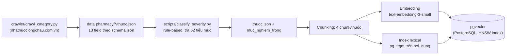
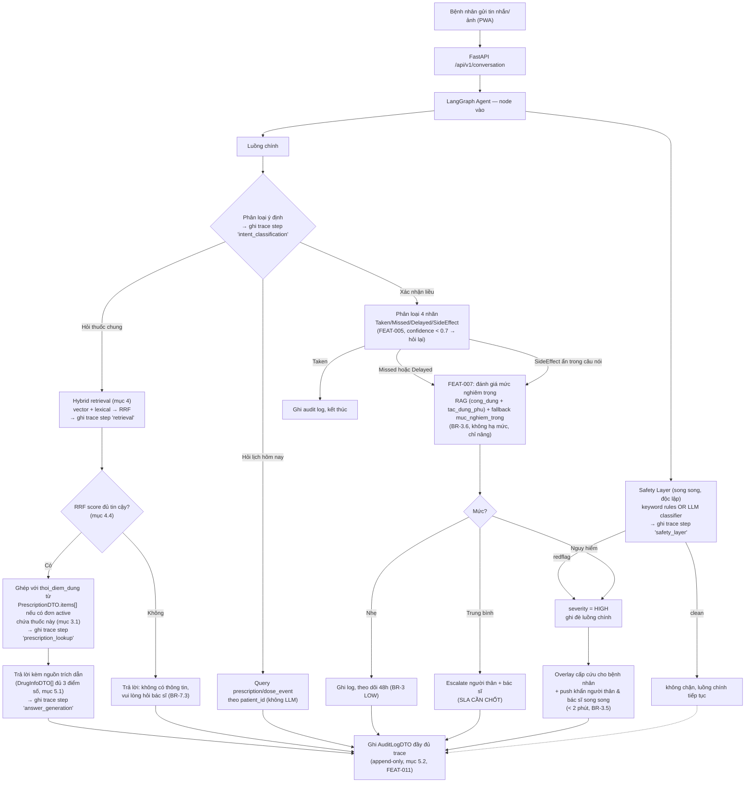

# Thiết kế Chatbot RAG — VMEC-04

> **Owner:** Architect (Nguyễn Minh Đạt) · **Cập nhật khi:** thay đổi model/chunking/dataflow
> Tài liệu này mô tả **chi tiết kỹ thuật** cho phần chatbot/RAG (FEAT-005, FEAT-006, FEAT-007, FEAT-008) —
> cụ thể hoá `product-vision.md`, `business-rules.md`, và các ADR liên quan (0006, 0008, 0009) thành
> dataflow và thiết kế có thể code được. Không lặp lại quyết định đã có ở các file đó, chỉ tham chiếu.
>
> Nguồn gốc: buổi thảo luận thiết kế ngày 2026-08-04 giữa Architect và AI assistant, dựa trên dữ liệu
> thật đã crawl trong `data pharmacy/` (3688 thuốc, 11 danh mục, 52 tiểu mục).

## 1. Phạm vi

Tài liệu bao phủ toàn bộ đường đi của **1 tin nhắn bệnh nhân** từ lúc gửi tới lúc có phản hồi/escalation,
và **pipeline dữ liệu offline** biến `data pharmacy/*/thuoc.json` thành nguồn RAG dùng được. Không bao gồm
FEAT-001–004 (phác đồ, lịch nhắc, xác nhận ảnh) trừ phần chúng giao nhau với chatbot.

**Ràng buộc bắt buộc cho mọi câu trả lời có dùng RAG** (thống nhất 2026-08-04, chi tiết ở mục 5):
mỗi phản hồi phải kèm **(a)** nguồn trích dẫn, **(b)** trace log các bước suy luận, **(c)** điểm số retrieval
minh bạch (không chỉ 1 con số cosine tổng hợp).

## 2. Model & chi phí

| Thành phần | Lựa chọn | Lý do |
|---|---|---|
| LLM lõi (mọi tác vụ) | **gpt-4o-mini**, dùng Structured Outputs/JSON mode | Rẻ, đủ cho classification + RAG-grounded QA (không phải reasoning mở); ràng buộc format cứng giúp tránh đúng rủi ro ADR-0009 nêu ("LLM trả sai format làm bỏ sót an toàn") |
| Embedding | **text-embedding-3-small** | Quy mô ~3700 bản ghi, không cần `-large` (ADR-0008: "vài nghìn bản ghi, không phải hàng triệu") |
| Vector store | **pgvector** (đã chốt, ADR-0008) | — |
| Lexical/keyword index | **pg_trgm + unaccent** (extension PostgreSQL) | Bổ trợ vector search cho hybrid retrieval (mục 4) — chọn trigram thay vì FTS chuẩn của Postgres vì FTS cần dictionary tiếng Việt (chưa có sẵn); **bắt buộc kèm `unaccent`** vì trigram trên chuỗi có dấu vs không dấu gần như không overlap (xem mục 4.2) |

**Ràng buộc chi phí (`product-vision.md` §6):** 1 phát ngôn bệnh nhân có thể chạm **3-4 lần gọi LLM**: safety layer (song song, FEAT-008) + phân loại 4 nhãn (FEAT-005) + RAG answer (FEAT-006, nếu có) + severity assessment (FEAT-007, nếu Missed/Delayed). Không dùng model đắt hơn cho bất kỳ bước nào trừ khi đo được accuracy không đạt (`eval/`, mục tiêu ≥85%). Hybrid retrieval (mục 4) **không** tốn thêm lần gọi LLM nào — cả vector lẫn lexical search đều chạy trong PostgreSQL.

## 3. Data pipeline offline — từ crawl tới pgvector



Bước C-D đã chạy xong (2026-08-04): 3688 thuốc, 1398 Nguy hiểm / 1403 Trung bình / 887 Nhẹ. Bước E-H **chưa
code** — mô tả thiết kế ở mục 3.1, 4.

### 3.1. Chunking strategy — theo nhóm field, không phải per-field hay per-record

4 chunk/thuốc, mỗi chunk tự chứa đủ ngữ cảnh để đứng độc lập khi retrieve (không phụ thuộc chunk khác):

| Chunk (`field_group`) | Field gộp từ `thuoc.json` | Vì sao gộp |
|---|---|---|
| `cong_dung` | `tac_dung` | Trả lời "thuốc này để làm gì" |
| `tac_dung_phu` | `tac_dung_phu` + `luu_y_dac_biet` | Cả 2 đều là "rủi ro khi dùng" |
| `cach_dung` | `huong_dan_su_dung` + `lieu_dung` + `duong_dung` | Dosing info tách ra sẽ mất ngữ cảnh |
| `bao_quan` | `huong_dan_bao_quan` | Ít khi hỏi chung với info khác |

`thoi_diem_dung` **không đưa vào RAG** — luôn rỗng trong `data pharmacy` theo thiết kế, vì đây không phải
kiến thức chung của thuốc mà là **chỉ định riêng của bác sĩ cho từng bệnh nhân**. Nguồn thật của field này
đã có sẵn trong contract: **`PrescriptionDTO.items[].thoi_diem_dung`** (`specs/api-contracts.md` §2) —
bác sĩ nhập lúc tạo phác đồ (FEAT-001), gắn với `drug_id` cụ thể. Từ lúc phác đồ được duyệt, cả bệnh nhân
lẫn chatbot đều biết thời điểm dùng qua đường này, **không phải qua RAG**.

**Hệ quả cho câu trả lời:** khi bệnh nhân hỏi "thuốc X dùng lúc nào/cách nào", câu trả lời đầy đủ phải
**ghép 2 nguồn**:
1. `cach_dung` chunk từ RAG (`huong_dan_su_dung`/`lieu_dung`/`duong_dung` — kiến thức chung của thuốc), và
2. `thoi_diem_dung` từ `PrescriptionDTO.items[]` **của chính bệnh nhân đó** (nếu đang có đơn active chứa
   thuốc này) — lấy qua tool `tra_cuu_don_thuoc_ca_nhan` (mục 6), join theo `drug_id`, không phải RAG.

Nếu bệnh nhân chưa có đơn nào chứa thuốc này (hỏi thuốc ngoài phác đồ của mình) → chỉ trả phần 1, và nói rõ
"thời điểm dùng cụ thể cần theo chỉ định của bác sĩ" thay vì bịa hoặc im lặng bỏ qua — đây là caveat bắt
buộc **thứ hai**, cùng loại với caveat `lieu_dung` ở mục 5.4 (ràng buộc ở `answer_generation`, audit hoá qua
trace bằng `caveat_thoi_diem_missing_inserted: bool`, áp dụng nhất quán nguyên tắc "mọi caveat bắt buộc đều
truy vết được" cho cả 2 trường hợp, không chỉ 1).

**Prefix cố định mỗi chunk:**
```
Thuốc: {ten_thuoc} ({ham_luong}, {dang_thuoc}) — {danh_muc}

{nội_dung_field}
```

**Metadata lưu kèm vector** (bắt buộc theo ADR-0008 — mọi chunk phải trace về được nguồn):

```
drug_id       = thuoc.id
danh_muc
muc_nghiem_trong
field_group   -- "cong_dung" | "tac_dung_phu" | "cach_dung" | "bao_quan"
noi_dung      -- text gốc chưa embed, dùng trả cho DrugInfoDTO.noi_dung
```

`DrugInfoDTO.source` (theo `api-contracts.md` §8) sinh động lúc trả lời, không lưu cứng, vd:
`"tac_dung_phu — {ten_thuoc}"`.

## 4. Retrieval — hybrid search (vector + lexical) với RRF

Không dùng thuần vector similarity — bổ sung **lexical search** (khớp từ khoá/tên thuốc chính xác) chạy
song song, rồi **hợp nhất bằng Reciprocal Rank Fusion (RRF)**. Lý do: embedding semantic đôi khi xếp hạng
thấp 1 kết quả khớp **chính xác tên thuốc/hoạt chất** (vd bệnh nhân gõ đúng "Panadol Extra") nếu ngữ nghĩa
câu hỏi không sát — lexical search vá đúng điểm yếu này.

### 4.1. Hai chế độ lấy dữ liệu

| Chế độ | Khi nào dùng | Cách làm |
|---|---|---|
| **Filter theo `drug_id`** | Bệnh nhân đang confirm 1 liều cụ thể, hoặc hỏi "thuốc này" trong ngữ cảnh 1 `dose_event` đang mở | Lấy `drug_id` từ `dose_event`/`prescription` active của bệnh nhân đó → lấy thẳng 4 chunk của đúng thuốc, **không** cần retrieval (không vector, không lexical, không RRF) |
| **Hybrid search tự do** | Câu hỏi chung, không gắn thuốc cụ thể (vd "paracetamol dùng sao") | Chạy song song 2 truy vấn (mục 4.2), hợp nhất bằng RRF (mục 4.3), lấy `top_k = 3-5` sau hợp nhất |

### 4.2. Hai nguồn xếp hạng (trước khi hợp nhất)

| Nguồn | Cách tính | Bắt được gì |
|---|---|---|
| **Vector (semantic)** | Cosine similarity giữa embedding câu hỏi và `pgvector` (HNSW) | Ý nghĩa gần đúng dù không trùng từ (vd "thuốc hạ sốt" ≈ "giảm đau, hạ sốt") |
| **Lexical (keyword)** | `pg_trgm` trên cột **đã bỏ dấu** (xem dưới) | Khớp chính xác tên thuốc/hoạt chất/số liều mà semantic có thể xếp thấp |

**Bỏ dấu bắt buộc trước khi so khớp trigram:** bệnh nhân gõ trên điện thoại rất hay bỏ dấu tiếng Việt (vd
"thuoc ha sot" thay vì "thuốc hạ sốt") — trigram trên chuỗi có dấu vs không dấu gần như không overlap. Dùng
extension `unaccent` của PostgreSQL: lưu thêm cột `noi_dung_unaccent` / `ten_thuoc_unaccent` (build lúc
embedding, mục 3), build trigram index trên các cột đã bỏ dấu này, và **unaccent luôn câu hỏi** trước khi
query lexical (không unaccent câu hỏi mà so với cột đã unaccent sẽ vẫn miss).

**2 hàm trigram khác nhau cho 2 mục đích khác nhau** — đây là 1 gotcha phổ biến của `pg_trgm`: hàm
`similarity()` chuẩn tính tỷ lệ trigram chung trên **tổng trigram của cả 2 chuỗi**, nên khi so 1 câu hỏi
ngắn với 1 đoạn `noi_dung` dài, điểm bị pha loãng dù khớp chính xác 1 đoạn con. Vì vậy:

| So khớp với | Hàm dùng | Vì sao |
|---|---|---|
| `ten_thuoc_unaccent` | `similarity()` (toán tử `%`) | Cả 2 chuỗi đều ngắn (câu hỏi vs tên thuốc) — không bị pha loãng |
| `noi_dung_unaccent` | `word_similarity()` (toán tử `<%>`) | Thiết kế riêng cho câu hỏi ngắn khớp vào văn bản dài — không pha loãng theo độ dài `noi_dung` |

### 4.3. Lọc ngưỡng thô TRƯỚC khi hợp nhất — RRF không thay được bước này

**Vấn đề cốt lõi của RRF:** RRF chỉ dùng **rank** (thứ hạng), không dùng giá trị điểm tuyệt đối. Vector
search luôn trả về "hàng xóm gần nhất" trong không gian embedding **kể cả khi không có gì thực sự gần** —
nếu bệnh nhân hỏi về 1 thuốc ngoài 3688 bản ghi hoặc gõ sai tên nghiêm trọng, top-1 sau RRF vẫn có thể có
điểm "đẹp" (vd đứng hạng 1 ở cả 2 nguồn) dù nội dung hoàn toàn không liên quan → hệ thống tưởng nhầm là "đủ
tin cậy" → trả lời sai thuốc một cách tự tin. **RRF chỉ giỏi sắp xếp trong số ứng viên đã hợp lệ, không phát
hiện được "không có gì liên quan cả".**

**Sửa bằng cách thêm bước lọc ngưỡng thô ở TỪNG NGUỒN, trước khi đưa vào RRF:**

```
1. Vector search   → giữ lại chunk có cosine similarity >= NGUONG_VECTOR       => tập A
2. Lexical search  → giữ lại chunk có word_similarity/similarity >= NGUONG_LEXICAL => tập B
3. Tập ứng viên hợp lệ = A ∪ B (OR — 1 chunk chỉ cần qua MỘT trong hai ngưỡng là đủ vào tập này)
4. Nếu A ∪ B rỗng (= tập ở bước 3 rỗng) → coi là "không có nguồn" ngay lập tức,
   KHÔNG chạy RRF (vì không có gì hợp lệ để xếp hạng)
5. Nếu A ∪ B khác rỗng → chạy RRF (mục dưới) CHỈ trên các chunk trong A ∪ B
```

**Lưu ý khi code:** bước 4 tham chiếu thẳng tới **tập đã định nghĩa ở bước 3** (`A ∪ B`, logic OR) — không
diễn giải lại bằng câu tự nhiên kiểu "qua ngưỡng ở cả hai nguồn", vì "cả hai" dễ đọc nhầm thành AND (giao,
không phải hợp), sẽ làm ngược đúng mục đích của bước 1-3: 1 chunk khớp semantic tốt nhưng không khớp lexical
(hoặc ngược lại) vẫn phải được coi là ứng viên hợp lệ, chỉ bị loại khi **không qua ngưỡng nào ở cả hai
nguồn** (tức không thuộc A và cũng không thuộc B).

`[CẦN CHỐT — thực nghiệm]` `NGUONG_VECTOR`, `NGUONG_LEXICAL`, hằng số `k` (đề xuất 60), `top_k` sau hợp nhất
(đề xuất 5) — tất cả cần tinh chỉnh khi có `eval/`, nhưng **thứ tự bước (lọc trước, RRF sau) là quyết định
kiến trúc chốt ngay từ bây giờ**, không đợi thực nghiệm rồi mới phát hiện sai chỗ.

**Cảnh báo riêng cho `NGUONG_VECTOR` — đặc tính của `text-embedding-3-small`:** embedding OpenAI có tính
chất anisotropy đã được ghi nhận thực nghiệm rộng rãi — cosine similarity giữa 2 câu **hoàn toàn không liên
quan** vẫn thường ở mức khá cao (nhiều báo cáo thấy quanh 0.6-0.7+), không gần 0 như trực giác "không liên
quan = điểm thấp" hay lầm tưởng. Chọn `NGUONG_VECTOR` theo cảm tính (vd "nghe hợp lý thì để 0.5") gần như vô
nghĩa — gần như mọi câu hỏi đều qua ngưỡng đó dù không liên quan gì. **Bắt buộc đo phân phối cosine similarity
thực tế trên 1 tập câu hỏi out-of-domain đã biết chắc "không liên quan"** (vd hỏi về thuốc ngoài 3688 bản
ghi, hoặc câu hỏi ngẫu nhiên không phải y tế) trước khi chọn số, không đoán.

**Vì sao vẫn chọn RRF (không phải alpha-weighting) cho bước hợp nhất ở #3:**

| | RRF | Alpha Weighting (`score = α·vector + (1-α)·lexical`) |
|---|---|---|
| Cần chuẩn hoá thang điểm? | **Không** — chỉ dùng rank | **Có** — cosine và trigram cùng khoảng [0,1] nhưng phân bố khác nhau |
| Cần tinh chỉnh tham số? | 1 hằng số `k`, ít nhạy | Cần tinh chỉnh `α`, dễ overfit bộ test nhỏ |

Alpha-weighting vẫn giữ làm **phương án dự phòng** nếu sau này RRF không đủ tốt.

```
RRF_score(d) = Σ  1 / (k + rank_i(d))     (k = 60, tham chiếu chuẩn phổ biến)
              i ∈ {vector, lexical}
```

### 4.4. Ngưỡng "không có nguồn" (BR-7.3)

Xảy ra ở **2 điểm khác nhau**, không phải 1 ngưỡng duy nhất:
1. **Không chunk nào qua ngưỡng thô** (mục 4.3 bước 4) → từ chối ngay, không cần tính RRF.
2. **Có qua ngưỡng thô nhưng top-1 sau RRF vẫn thấp bất thường** `[CẦN CHỐT — có cần ngưỡng phụ ở đây
   không, hay bước 4.3 đã đủ]` — đề xuất: nếu đã lọc đúng ở 4.3, bước này có thể bỏ để tránh ngưỡng chồng
   ngưỡng khó tinh chỉnh.

Cả 2 trường hợp đều dẫn tới agent trả lời từ chối theo đúng câu ở BR-7.3, không đưa chunk vào prompt.

## 5. Nguồn trích dẫn, Trace log & Minh bạch điểm số

*(thống nhất 2026-08-04 — áp dụng cho **mọi** phản hồi có dùng RAG, không phải tuỳ chọn)*

### 5.1. Nguồn trích dẫn

Đã có contract (`DrugInfoDTO`, `api-contracts.md` §8, `source` bắt buộc không rỗng — BR-7.3). Bổ sung ở đây:
mỗi `DrugInfoDTO` trả kèm **cả 3 điểm số**, không chỉ 1 số tổng hợp, để minh bạch retrieval hoạt động ra sao:

```json
{
  "drug_id": "panadol-extra",
  "ten_thuoc": "Panadol Extra",
  "field_group": "cach_dung",
  "noi_dung": "Uống nguyên viên với nhiều nước, không nhai...",
  "source": "cach_dung — Panadol Extra",
  "vector_score": 0.81,
  "lexical_score": 0.42,
  "rrf_score": 0.031,
  "rank": 1
}
```

### 5.2. Trace log — xem chatbot "suy nghĩ" thế nào

Hiện `audit_log` mới được nhắc tới ở mức khái niệm ("ghi reasoning, confidence, nguồn RAG" — FEAT-011,
ADR-0004, ADR-0005) nhưng **chưa có schema cụ thể** ở đâu trong repo. Định nghĩa ở đây:

```json
// AuditLogDTO — 1 bản ghi cho 1 lượt xử lý utterance, append-only (BR-7.5)
{
  "id": "audit_00123",
  "patient_id": "usr_02",
  "dose_event_id": "dose_1001",
  "utterance": "thuốc này uống lúc nào",
  "created_at": "2026-08-10T08:02:11+07:00",
  "trace": [
    {
      "step": "safety_layer",
      "keyword_hit": false,
      "llm_flag": false,
      "model": null,
      "duration_ms": 8
    },
    {
      "step": "intent_classification",
      "model": "gpt-4o-mini",
      "prompt_version": "intent-v1",
      "result": "drug_info",
      "confidence": 0.93,
      "duration_ms": 340
    },
    {
      "step": "retrieval",
      "mode": "hybrid_search",
      "query": "thuốc này uống lúc nào",
      "top_k": 5,
      "results": ["<DrugInfoDTO[] — xem mục 5.1, đủ 3 điểm số>"],
      "duration_ms": 45
    },
    {
      "step": "prescription_lookup",
      "drug_id": "panadol-extra",
      "found": true,
      "thoi_diem_dung": "sau ăn sáng và sau ăn tối",
      "duration_ms": 12
    },
    {
      "step": "answer_generation",
      "model": "gpt-4o-mini",
      "prompt_version": "answer-v1",
      "sources_used": ["panadol-extra:cach_dung"],
      "caveat_lieu_dung_inserted": true,
      "caveat_thoi_diem_missing_inserted": false,
      "duration_ms": 620
    }
  ],
  "final_response": "Panadol Extra uống nguyên viên với nhiều nước... Theo đơn của bạn, uống sau ăn sáng và sau ăn tối.",
  "total_duration_ms": 1025
}
```

**Nguyên tắc:**
- Mỗi bước (`step`) trong `trace` ghi tối thiểu: tên bước, model dùng (nếu có), input rút gọn/tham số,
  kết quả, độ tin cậy (nếu có), thời gian xử lý — khớp AC của FEAT-011.
- `trace` là **mảng theo đúng thứ tự thực thi**, kể cả nhánh bị bỏ qua (vd nếu `safety_layer` cắt luồng thì
  các bước sau không xuất hiện — trace vẫn cho thấy dừng ở đâu và vì sao).
- Lưu trong bảng `audit_log` (Postgres, đã có tên trong ADR-0004), **append-only**, không sửa/xoá (BR-7.5).
- **Ai xem được:** bác sĩ xem audit log của bệnh nhân mình phụ trách (FEAT-011 AC) — hiển thị trace dạng
  rút gọn (tên bước + kết quả) trên dashboard, không cần phơi bày prompt đầy đủ. `[CẦN CHỐT]` có cho bệnh
  nhân/người thân xem trace hay chỉ bác sĩ — đề xuất chỉ bác sĩ, vì trace kỹ thuật không có ý nghĩa với
  bệnh nhân và tốn công thiết kế UI riêng.

### 5.3. Vì sao bắt buộc cả 3 thứ cùng lúc

Đây không phải 3 tính năng độc lập — chúng cùng phục vụ 1 mục tiêu đã có trong `product-vision.md`
("mọi hành động của AI đều truy vết được"): **nguồn trích dẫn** trả lời "câu trả lời dựa vào đâu", **trace
log** trả lời "agent đi qua những bước nào để tới đó", **điểm số retrieval minh bạch** trả lời "vì sao đúng
mấy nguồn này được chọn mà không phải nguồn khác" — thiếu 1 trong 3, khi có sự cố sẽ không tái hiện được lý
do agent trả lời sai.

### 5.4. Caveat bắt buộc khi trả lời liều dùng chung

`lieu_dung` nằm trong chunk `cach_dung` (mục 3.1) và được trả lời như **kiến thức chung theo nhãn thuốc**,
khác với `thoi_diem_dung` (đã tách hẳn ra khỏi RAG vì là chỉ định cá nhân). Về nguyên tắc `lieu_dung` đúng
là thông tin chung (nhãn thuốc ghi "1-2 viên/lần" cho mọi người), nhưng nếu chỉ đưa thẳng cho bệnh nhân mà
không kèm cảnh báo, dễ khiến họ suy ra liều dùng thực tế cho bản thân từ thông tin chung này — trong khi
liều thật của họ do bác sĩ chỉ định (có thể khác, đặc biệt với người suy gan/suy thận/trẻ em).

**Ràng buộc bắt buộc ở bước `answer_generation`:** khi câu trả lời dùng chunk `field_group = cach_dung`
(chứa `lieu_dung`), system prompt phải luôn chèn câu dạng "Đây là liều khuyến cáo chung theo nhãn thuốc,
liều thực tế của bạn có thể khác theo chỉ định của bác sĩ." Không để ngầm hiểu qua domain separation ở
mục 6 — đó là tách **nguồn dữ liệu**, không đảm bảo caveat **xuất hiện trong câu trả lời**.

**Auditability:** field `caveat_lieu_dung_inserted: bool` trong trace step `answer_generation` (mục 5.2) xác
nhận caveat có được chèn hay không cho từng lượt trả lời — nếu sau này phát hiện 1 câu trả lời thiếu caveat,
tra được ngay qua audit log thay vì chỉ đoán. Áp dụng **cùng nguyên tắc** cho caveat còn lại ở mục 3.1 (khi
bệnh nhân hỏi thuốc ngoài phác đồ, thiếu `thoi_diem_dung`) qua field `caveat_thoi_diem_missing_inserted:
bool` — không để 1 caveat được audit hoá còn caveat kia thì không.

## 6. Phân biệt 3 domain câu hỏi — điểm dễ nhầm nhất

| Bệnh nhân hỏi | Domain |
|---|---|
| "Tác dụng phụ của thuốc X là gì?" / "thuốc này uống bao nhiêu viên/lần?" | FEAT-006, RAG hybrid trên `data pharmacy` (mục 3-4) |
| "Hôm nay tôi uống thuốc gì?" / "tôi còn liều nào chưa uống?" | Query trực tiếp `prescription`/`dose_event` **của chính bệnh nhân đó** — 1 tool call SQL, không cần LLM suy luận, không phải RAG |
| "Thuốc X tôi uống lúc nào?" (trước/sau ăn, mấy giờ) | **Không phải RAG, cũng không suy ra từ `data pharmacy`** — đọc `PrescriptionDTO.items[].thoi_diem_dung` (join theo `drug_id`) từ đơn thuốc đang active của bệnh nhân, xem mục 3.1 |

Tách **3** tool riêng trong LangGraph: `tra_cuu_thuoc_chung` (RAG hybrid) · `tra_cuu_lich_uong_ca_nhan` (query
`dose_event` theo `patient_id`) · `tra_cuu_don_thuoc_ca_nhan` (query `prescription.items[]` theo `patient_id`
+ `drug_id`, dùng cho cả câu hỏi "lúc nào" lẫn khi cần ghép với RAG ở mục 3.1). Gộp chung rủi ro: agent trả
lời câu hỏi cá nhân hoá bằng kiến thức chung (sai), hoặc tệ hơn lộ dữ liệu bệnh nhân khác qua nhầm lẫn ngữ
cảnh.

**Quyết định tường minh — domain 3 KHÔNG có nhánh tắt bỏ qua RAG:** dù domain 3 (chỉ hỏi giờ giấc) về lý
thuyết chỉ cần `tra_cuu_don_thuoc_ca_nhan`, thiết kế ở mục 8 vẫn cho đi qua chung nhánh `drug_info` → chạy
cả hybrid retrieval (mục 4) lẫn `tra_cuu_don_thuoc_ca_nhan`, rồi để `answer_generation` tự quyết dùng phần
nào. Lý do **không** thêm intent thứ 4 để tắt RAG: retrieval (vector + lexical) chạy hoàn toàn trong
PostgreSQL, **không tốn lần gọi LLM nào** (mục 2) — trong khi để phân biệt được "câu hỏi này có cần
`cach_dung` hay chỉ cần giờ giấc" cũng **cần** 1 lần gọi LLM hiểu ngữ nghĩa, tốn hơn chính retrieval đang
muốn tiết kiệm. Tách thêm intent chỉ thêm độ phức tạp mà không giảm được lần gọi LLM nào.

## 7. Safety layer — chạy song song, độc lập (ADR-0009, đã chốt)

Không thiết kế lại — tham chiếu ADR-0009 + `business-rules.md` §6. Điểm cần nhớ khi code chatbot:

- Chạy **song song** với toàn bộ luồng ở mục 8, không chờ luồng chính xong.
- 2 nhóm redflag (BR-6.6): **triệu chứng lâm sàng** (khó thở, đau ngực...) và **nguy cơ liều dùng bất
  thường** (vd "tôi có 10 viên thuốc ngủ, uống được không" — hỏi trước khi hành động, vẫn phải chặn HIGH
  ngay, không chờ xác nhận đã uống hay chưa — xem BR-6.7/6.8).
- Cờ đỏ → `severity = HIGH`, ghi đè luồng chính (BR-3.3), overlay cấp cứu + escalate < 2 phút.
- Bước `safety_layer` vẫn ghi vào `trace` (mục 5.2) dù không redflag, để audit thấy lớp này đã chạy.

## 8. Dataflow runtime — từ tin nhắn bệnh nhân tới phản hồi



### Ghi chú luồng

- **Safety layer không phải 1 node trong graph chính** — chạy như 1 task độc lập (async, song song) ngay khi
  nhận utterance, không phụ thuộc kết quả `INTENT`/`CLASSIFY`. Nếu redflag tới trước, cắt ngang bất kể luồng
  chính đang ở bước nào (ADR-0009 ràng buộc #3).
- **`INTENT`** là 1 bước phân loại nhẹ (có thể gộp vào cùng lần gọi LLM với `CLASSIFY` nếu ngữ cảnh đang mở
  1 `dose_event`, để tiết kiệm 1 lần gọi — `[CẦN CHỐT khi code]`).
- **`SEVERITY`** dùng RAG filter theo `drug_id` (không phải hybrid search tự do), **gộp cả 2 chunk**
  `cong_dung` (chứa field `tac_dung` — công dụng chung của thuốc) **và** `tac_dung_phu` (rủi ro/tác dụng
  phụ) làm nguồn chính — sửa 2026-08-08: bản trước chỉ ghi "`tac_dung`", nhưng theo mapping ở mục 3.1,
  field đó nằm trong chunk `cong_dung`, còn `tac_dung_phu` (rủi ro khi dùng) mới là nguồn hợp lý hơn cho
  việc đánh giá mức nghiêm trọng nếu chỉ dùng 1 chunk — gộp cả 2 để không phải chọn 1 (xem
  `SEVERITY_SOURCE_FIELD_GROUPS` trong `src/agents/nodes/dose_confirmation_nodes.py`). `muc_nghiem_trong`
  chỉ là fallback khi RAG không đủ rõ (BR-3.6).
- Mọi nhánh cuối cùng đều ghi `AUDIT` (append-only, BR-7.5) — **luôn kèm `trace` đầy đủ**, kể cả khi trả lời
  bằng đường không-LLM (`DB`) để giữ tính nhất quán của audit log.

## 9. Trạng thái LangGraph — phác thảo state schema

`[CẦN CHỐT chi tiết khi bắt đầu code — đây là bản phác thảo để thảo luận]`

```python
class ConversationState(TypedDict):
    patient_id: str
    dose_event_id: str | None       # None neu khong gan voi 1 lieu cu the
    utterance: str
    intent: Literal["drug_info", "today_schedule", "dose_confirmation"] | None
    classification: Literal["TAKEN", "MISSED", "DELAYED", "SIDE_EFFECT"] | None
    classification_confidence: float | None
    rag_results: list[DrugInfoDTO]           # kem vector_score/lexical_score/rrf_score (muc 5.1)
    prescription_instruction: str | None     # thoi_diem_dung tu PrescriptionDTO neu co (muc 3.1)
    severity: Literal["Nhẹ", "Trung bình", "Nguy hiểm"] | None
    safety_flag: bool                        # ket qua song song, khong phu thuoc cac field tren
    trace: list[dict]                        # tich luy tung buoc, ghi vao AuditLogDTO.trace (muc 5.2)
    response: str
```

## 10. Việc còn mở — `[CẦN CHỐT]`

| # | Việc | Ai quyết |
|---|---|---|
| 1 | Ngưỡng RRF score "không có nguồn" (mục 4.4) | Architect, tinh chỉnh thực nghiệm sau khi có `eval/` |
| 2 | Hằng số `k` cho RRF (đề xuất 60) và `top_k` sau hợp nhất (đề xuất 5) | Architect, tinh chỉnh thực nghiệm |
| 3 | SLA escalate mức Trung bình (đề xuất ≤15') | PM (đã ghi ở `business-rules.md` BR §3) |
| 4 | Gộp `INTENT` + `CLASSIFY` thành 1 lần gọi LLM hay tách riêng | Architect, quyết lúc code |
| 5 | Nhóm redflag "nguy cơ liều dùng bất thường" (BR-6.7/6.8) — nội dung overlay | PM + Phạm Thành Đạt |
| 6 | Bảng `muc_nghiem_trong` 52 tiểu mục — cần PM xác nhận chính thức | PM |
| 7 | Trace log có hiển thị cho bệnh nhân/người thân hay chỉ bác sĩ (đề xuất: chỉ bác sĩ) | PM |
| 8 | Ngưỡng lọc thô `NGUONG_VECTOR`/`NGUONG_LEXICAL` trước RRF (mục 4.3) | Architect, tinh chỉnh thực nghiệm |
| 9 | **[RỦI RO PHÁP LÝ — CHƯA CÓ ĐÁNH GIÁ]** `data pharmacy/` hiện crawl trực tiếp từ nhathuoclongchau.com.vn — 1 website thương mại; `crawler/report.md` chỉ đánh giá **khả năng kỹ thuật** để crawl (có bị chặn không, có tôn trọng `robots.txt` không), **chưa từng đánh giá quyền sử dụng lại nội dung** (bản quyền mô tả thuốc, ToS của site) cho mục đích ngoài coursework — xem ghi chú làm rõ ngay dưới bảng này. Cần quyết trước khi dùng ngoài phạm vi demo/nộp bài. | PM + BTC/mentor (vượt phạm vi quyết định kỹ thuật thuần) |

**Ghi chú cho mục #9:** khi được hỏi liệu đây có phải "quyết định tạm thời, sẽ đổi sang OpenFDA/mua license
trước khi lên production" — tôi (AI assistant) **không có bất kỳ ghi nhận nào** trong lịch sử làm việc ở
phiên này về việc từng khảo sát drugbank.vn/Long Châu/Pharmacity rồi chọn OpenFDA vì lý do pháp lý. Toàn bộ
quá trình thu thập `data pharmacy/` trong phiên này bắt đầu thẳng từ crawl Long Châu, không có bước khảo sát
nguồn thay thế nào được ghi lại. Nếu quyết định đó thật sự tồn tại, nhiều khả năng đến từ 1 phiên làm việc
khác (Cursor/Codex/Gemini CLI — repo có log cho nhiều tool, xem `.ai-log/`) mà tôi không truy cập được nội
dung. Cần Architect xác nhận lại nguồn của quyết định đó trước khi coi đây là điều đã chốt.

---
**Liên kết:** [`business-rules.md`](./business-rules.md) §3, §6 · [`features.md`](./features.md) FEAT-005–008
· [ADR-0006](../adrs/0006-tech-stack.md) · [ADR-0008](../adrs/0008-vector-store-pgvector.md) ·
[ADR-0009](../adrs/0009-safety-layer-dual-classifier.md) · [`data pharmacy/schema.json`](../data%20pharmacy/schema.json)
· [`scripts/classify_severity.py`](../scripts/classify_severity.py) · [`api-contracts.md`](./api-contracts.md) §8
