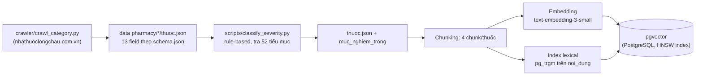
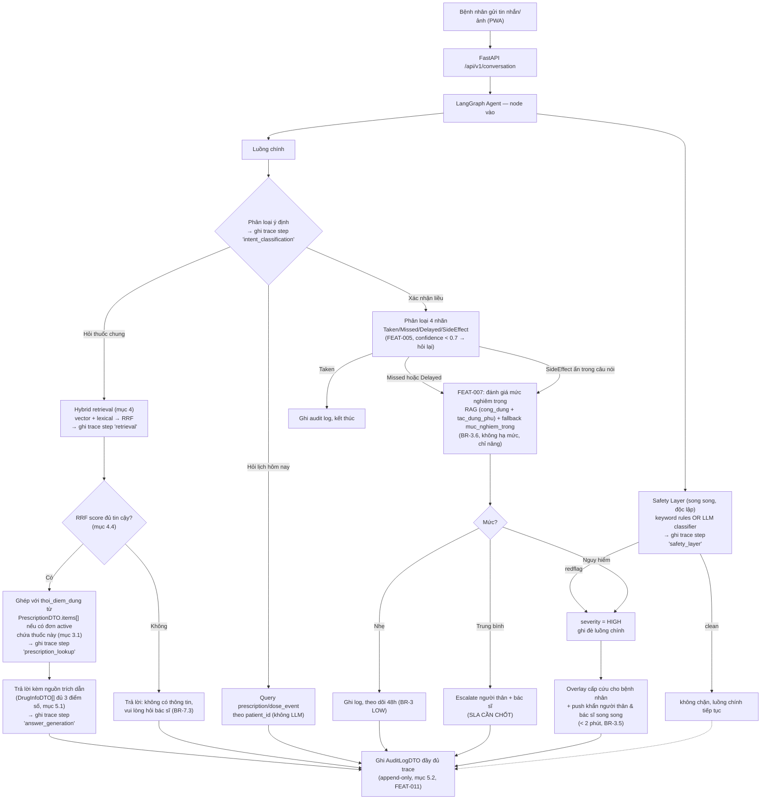

# Thiết kế Chatbot RAG — VMEC-04

> **Owner:** Architect (Nguyễn Minh Đạt) · **Cập nhật khi:** thay đổi model/chunking/dataflow
> Tài liệu này mô tả **chi tiết kỹ thuật** cho phần chatbot/RAG (FEAT-005, FEAT-006, FEAT-007, FEAT-008) —
> cụ thể hoá `product-vision.md`, `business-rules.md`, và các ADR liên quan (0006, 0008, 0009) thành
> dataflow và thiết kế có thể code được. Không lặp lại quyết định đã có ở các file đó, chỉ tham chiếu.
>
> Nguồn gốc: buổi thảo luận thiết kế ngày 2026-08-04 giữa Architect và AI assistant, dựa trên dữ liệu
> thật đã crawl trong `data pharmacy/` (3688 thuốc, 11 danh mục, 52 tiểu mục).

## 1. Phạm vi

Tài liệu bao phủ toàn bộ đường đi của **1 tin nhắn bệnh nhân** từ lúc gửi tới lúc có phản hồi/escalation,
và **pipeline dữ liệu offline** biến `data pharmacy/*/thuoc.json` thành nguồn RAG dùng được. Không bao gồm
FEAT-001–004 (phác đồ, lịch nhắc, xác nhận ảnh) trừ phần chúng giao nhau với chatbot.

**Ràng buộc bắt buộc cho mọi câu trả lời có dùng RAG** (thống nhất 2026-08-04, chi tiết ở mục 5):
mỗi phản hồi phải kèm **(a)** nguồn trích dẫn, **(b)** trace log các bước suy luận, **(c)** điểm số retrieval
minh bạch (không chỉ 1 con số cosine tổng hợp).

## 2. Model & chi phí

| Thành phần | Lựa chọn | Lý do |
|---|---|---|
| LLM lõi (mọi tác vụ) | **gpt-4o-mini**, dùng Structured Outputs/JSON mode | Rẻ, đủ cho classification + RAG-grounded QA (không phải reasoning mở); ràng buộc format cứng giúp tránh đúng rủi ro ADR-0009 nêu ("LLM trả sai format làm bỏ sót an toàn") |
| Embedding | **text-embedding-3-small** | Quy mô ~3700 bản ghi, không cần `-large` (ADR-0008: "vài nghìn bản ghi, không phải hàng triệu") |
| Vector store | **pgvector** (đã chốt, ADR-0008) | — |
| Lexical/keyword index | **pg_trgm + unaccent** (extension PostgreSQL) | Bổ trợ vector search cho hybrid retrieval (mục 4) — chọn trigram thay vì FTS chuẩn của Postgres vì FTS cần dictionary tiếng Việt (chưa có sẵn); **bắt buộc kèm `unaccent`** vì trigram trên chuỗi có dấu vs không dấu gần như không overlap (xem mục 4.2) |

**Ràng buộc chi phí (`product-vision.md` §6):** 1 phát ngôn bệnh nhân có thể chạm **3-4 lần gọi LLM**: safety layer (song song, FEAT-008) + phân loại 4 nhãn (FEAT-005) + RAG answer (FEAT-006, nếu có) + severity assessment (FEAT-007, nếu Missed/Delayed). Không dùng model đắt hơn cho bất kỳ bước nào trừ khi đo được accuracy không đạt (`eval/`, mục tiêu ≥85%). Hybrid retrieval (mục 4) **không** tốn thêm lần gọi LLM nào — cả vector lẫn lexical search đều chạy trong PostgreSQL.

## 3. Data pipeline offline — từ crawl tới pgvector



Bước C-D đã chạy xong (2026-08-04): 3688 thuốc, 1398 Nguy hiểm / 1403 Trung bình / 887 Nhẹ. Bước E-H **chưa
code** — mô tả thiết kế ở mục 3.1, 4.

### 3.1. Chunking strategy — theo nhóm field, không phải per-field hay per-record

4 chunk/thuốc, mỗi chunk tự chứa đủ ngữ cảnh để đứng độc lập khi retrieve (không phụ thuộc chunk khác):

| Chunk (`field_group`) | Field gộp từ `thuoc.json` | Vì sao gộp |
|---|---|---|
| `cong_dung` | `tac_dung` | Trả lời "thuốc này để làm gì" |
| `tac_dung_phu` | `tac_dung_phu` + `luu_y_dac_biet` | Cả 2 đều là "rủi ro khi dùng" |
| `cach_dung` | `huong_dan_su_dung` + `lieu_dung` + `duong_dung` | Dosing info tách ra sẽ mất ngữ cảnh |
| `bao_quan` | `huong_dan_bao_quan` | Ít khi hỏi chung với info khác |

`thoi_diem_dung` **không đưa vào RAG** — luôn rỗng trong `data pharmacy` theo thiết kế, vì đây không phải
kiến thức chung của thuốc mà là **chỉ định riêng của bác sĩ cho từng bệnh nhân**. Nguồn thật của field này
đã có sẵn trong contract: **`PrescriptionDTO.items[].thoi_diem_dung`** (`specs/api-contracts.md` §2) —
bác sĩ nhập lúc tạo phác đồ (FEAT-001), gắn với `drug_id` cụ thể. Từ lúc phác đồ được duyệt, cả bệnh nhân
lẫn chatbot đều biết thời điểm dùng qua đường này, **không phải qua RAG**.

**Hệ quả cho câu trả lời:** khi bệnh nhân hỏi "thuốc X dùng lúc nào/cách nào", câu trả lời đầy đủ phải
**ghép 2 nguồn**:
1. `cach_dung` chunk từ RAG (`huong_dan_su_dung`/`lieu_dung`/`duong_dung` — kiến thức chung của thuốc), và
2. `thoi_diem_dung` từ `PrescriptionDTO.items[]` **của chính bệnh nhân đó** (nếu đang có đơn active chứa
   thuốc này) — lấy qua tool `tra_cuu_don_thuoc_ca_nhan` (mục 6), join theo `drug_id`, không phải RAG.

Nếu bệnh nhân chưa có đơn nào chứa thuốc này (hỏi thuốc ngoài phác đồ của mình) → chỉ trả phần 1, và nói rõ
"thời điểm dùng cụ thể cần theo chỉ định của bác sĩ" thay vì bịa hoặc im lặng bỏ qua — đây là caveat bắt
buộc **thứ hai**, cùng loại với caveat `lieu_dung` ở mục 5.4 (ràng buộc ở `answer_generation`, audit hoá qua
trace bằng `caveat_thoi_diem_missing_inserted: bool`, áp dụng nhất quán nguyên tắc "mọi caveat bắt buộc đều
truy vết được" cho cả 2 trường hợp, không chỉ 1).

**Prefix cố định mỗi chunk:**
```
Thuốc: {ten_thuoc} ({ham_luong}, {dang_thuoc}) — {danh_muc}

{nội_dung_field}
```

**Metadata lưu kèm vector** (bắt buộc theo ADR-0008 — mọi chunk phải trace về được nguồn):

```
drug_id       = thuoc.id
danh_muc
muc_nghiem_trong
field_group   -- "cong_dung" | "tac_dung_phu" | "cach_dung" | "bao_quan"
noi_dung      -- text gốc chưa embed, dùng trả cho DrugInfoDTO.noi_dung
```

`DrugInfoDTO.source` (theo `api-contracts.md` §8) sinh động lúc trả lời, không lưu cứng, vd:
`"tac_dung_phu — {ten_thuoc}"`.

## 4. Retrieval — hybrid search (vector + lexical) với RRF

Không dùng thuần vector similarity — bổ sung **lexical search** (khớp từ khoá/tên thuốc chính xác) chạy
song song, rồi **hợp nhất bằng Reciprocal Rank Fusion (RRF)**. Lý do: embedding semantic đôi khi xếp hạng
thấp 1 kết quả khớp **chính xác tên thuốc/hoạt chất** (vd bệnh nhân gõ đúng "Panadol Extra") nếu ngữ nghĩa
câu hỏi không sát — lexical search vá đúng điểm yếu này.

### 4.1. Hai chế độ lấy dữ liệu

| Chế độ | Khi nào dùng | Cách làm |
|---|---|---|
| **Filter theo `drug_id`** | Bệnh nhân đang confirm 1 liều cụ thể, hoặc hỏi "thuốc này" trong ngữ cảnh 1 `dose_event` đang mở | Lấy `drug_id` từ `dose_event`/`prescription` active của bệnh nhân đó → lấy thẳng 4 chunk của đúng thuốc, **không** cần retrieval (không vector, không lexical, không RRF) |
| **Hybrid search tự do** | Câu hỏi chung, không gắn thuốc cụ thể (vd "paracetamol dùng sao") | Chạy song song 2 truy vấn (mục 4.2), hợp nhất bằng RRF (mục 4.3), lấy `top_k = 3-5` sau hợp nhất |

### 4.2. Hai nguồn xếp hạng (trước khi hợp nhất)

| Nguồn | Cách tính | Bắt được gì |
|---|---|---|
| **Vector (semantic)** | Cosine similarity giữa embedding câu hỏi và `pgvector` (HNSW) | Ý nghĩa gần đúng dù không trùng từ (vd "thuốc hạ sốt" ≈ "giảm đau, hạ sốt") |
| **Lexical (keyword)** | `pg_trgm` trên cột **đã bỏ dấu** (xem dưới) | Khớp chính xác tên thuốc/hoạt chất/số liều mà semantic có thể xếp thấp |

**Bỏ dấu bắt buộc trước khi so khớp trigram:** bệnh nhân gõ trên điện thoại rất hay bỏ dấu tiếng Việt (vd
"thuoc ha sot" thay vì "thuốc hạ sốt") — trigram trên chuỗi có dấu vs không dấu gần như không overlap. Dùng
extension `unaccent` của PostgreSQL: lưu thêm cột `noi_dung_unaccent` / `ten_thuoc_unaccent` (build lúc
embedding, mục 3), build trigram index trên các cột đã bỏ dấu này, và **unaccent luôn câu hỏi** trước khi
query lexical (không unaccent câu hỏi mà so với cột đã unaccent sẽ vẫn miss).

**2 hàm trigram khác nhau cho 2 mục đích khác nhau** — đây là 1 gotcha phổ biến của `pg_trgm`: hàm
`similarity()` chuẩn tính tỷ lệ trigram chung trên **tổng trigram của cả 2 chuỗi**, nên khi so 1 câu hỏi
ngắn với 1 đoạn `noi_dung` dài, điểm bị pha loãng dù khớp chính xác 1 đoạn con. Vì vậy:

| So khớp với | Hàm dùng | Vì sao |
|---|---|---|
| `ten_thuoc_unaccent` | `similarity()` (toán tử `%`) | Cả 2 chuỗi đều ngắn (câu hỏi vs tên thuốc) — không bị pha loãng |
| `noi_dung_unaccent` | `word_similarity()` (toán tử `<%>`) | Thiết kế riêng cho câu hỏi ngắn khớp vào văn bản dài — không pha loãng theo độ dài `noi_dung` |

### 4.3. Lọc ngưỡng thô TRƯỚC khi hợp nhất — RRF không thay được bước này

**Vấn đề cốt lõi của RRF:** RRF chỉ dùng **rank** (thứ hạng), không dùng giá trị điểm tuyệt đối. Vector
search luôn trả về "hàng xóm gần nhất" trong không gian embedding **kể cả khi không có gì thực sự gần** —
nếu bệnh nhân hỏi về 1 thuốc ngoài 3688 bản ghi hoặc gõ sai tên nghiêm trọng, top-1 sau RRF vẫn có thể có
điểm "đẹp" (vd đứng hạng 1 ở cả 2 nguồn) dù nội dung hoàn toàn không liên quan → hệ thống tưởng nhầm là "đủ
tin cậy" → trả lời sai thuốc một cách tự tin. **RRF chỉ giỏi sắp xếp trong số ứng viên đã hợp lệ, không phát
hiện được "không có gì liên quan cả".**

**Sửa bằng cách thêm bước lọc ngưỡng thô ở TỪNG NGUỒN, trước khi đưa vào RRF:**

```
1. Vector search   → giữ lại chunk có cosine similarity >= NGUONG_VECTOR       => tập A
2. Lexical search  → giữ lại chunk có word_similarity/similarity >= NGUONG_LEXICAL => tập B
3. Tập ứng viên hợp lệ = A ∪ B (OR — 1 chunk chỉ cần qua MỘT trong hai ngưỡng là đủ vào tập này)
4. Nếu A ∪ B rỗng (= tập ở bước 3 rỗng) → coi là "không có nguồn" ngay lập tức,
   KHÔNG chạy RRF (vì không có gì hợp lệ để xếp hạng)
5. Nếu A ∪ B khác rỗng → chạy RRF (mục dưới) CHỈ trên các chunk trong A ∪ B
```

**Lưu ý khi code:** bước 4 tham chiếu thẳng tới **tập đã định nghĩa ở bước 3** (`A ∪ B`, logic OR) — không
diễn giải lại bằng câu tự nhiên kiểu "qua ngưỡng ở cả hai nguồn", vì "cả hai" dễ đọc nhầm thành AND (giao,
không phải hợp), sẽ làm ngược đúng mục đích của bước 1-3: 1 chunk khớp semantic tốt nhưng không khớp lexical
(hoặc ngược lại) vẫn phải được coi là ứng viên hợp lệ, chỉ bị loại khi **không qua ngưỡng nào ở cả hai
nguồn** (tức không thuộc A và cũng không thuộc B).

`[CẦN CHỐT — thực nghiệm]` `NGUONG_VECTOR`, `NGUONG_LEXICAL`, hằng số `k` (đề xuất 60), `top_k` sau hợp nhất
(đề xuất 5) — tất cả cần tinh chỉnh khi có `eval/`, nhưng **thứ tự bước (lọc trước, RRF sau) là quyết định
kiến trúc chốt ngay từ bây giờ**, không đợi thực nghiệm rồi mới phát hiện sai chỗ.

**Cảnh báo riêng cho `NGUONG_VECTOR` — đặc tính của `text-embedding-3-small`:** embedding OpenAI có tính
chất anisotropy đã được ghi nhận thực nghiệm rộng rãi — cosine similarity giữa 2 câu **hoàn toàn không liên
quan** vẫn thường ở mức khá cao (nhiều báo cáo thấy quanh 0.6-0.7+), không gần 0 như trực giác "không liên
quan = điểm thấp" hay lầm tưởng. Chọn `NGUONG_VECTOR` theo cảm tính (vd "nghe hợp lý thì để 0.5") gần như vô
nghĩa — gần như mọi câu hỏi đều qua ngưỡng đó dù không liên quan gì. **Bắt buộc đo phân phối cosine similarity
thực tế trên 1 tập câu hỏi out-of-domain đã biết chắc "không liên quan"** (vd hỏi về thuốc ngoài 3688 bản
ghi, hoặc câu hỏi ngẫu nhiên không phải y tế) trước khi chọn số, không đoán.

**Vì sao vẫn chọn RRF (không phải alpha-weighting) cho bước hợp nhất ở #3:**

| | RRF | Alpha Weighting (`score = α·vector + (1-α)·lexical`) |
|---|---|---|
| Cần chuẩn hoá thang điểm? | **Không** — chỉ dùng rank | **Có** — cosine và trigram cùng khoảng [0,1] nhưng phân bố khác nhau |
| Cần tinh chỉnh tham số? | 1 hằng số `k`, ít nhạy | Cần tinh chỉnh `α`, dễ overfit bộ test nhỏ |

Alpha-weighting vẫn giữ làm **phương án dự phòng** nếu sau này RRF không đủ tốt.

```
RRF_score(d) = Σ  1 / (k + rank_i(d))     (k = 60, tham chiếu chuẩn phổ biến)
              i ∈ {vector, lexical}
```

### 4.4. Ngưỡng "không có nguồn" (BR-7.3)

Xảy ra ở **2 điểm khác nhau**, không phải 1 ngưỡng duy nhất:
1. **Không chunk nào qua ngưỡng thô** (mục 4.3 bước 4) → từ chối ngay, không cần tính RRF.
2. **Có qua ngưỡng thô nhưng top-1 sau RRF vẫn thấp bất thường** `[CẦN CHỐT — có cần ngưỡng phụ ở đây
   không, hay bước 4.3 đã đủ]` — đề xuất: nếu đã lọc đúng ở 4.3, bước này có thể bỏ để tránh ngưỡng chồng
   ngưỡng khó tinh chỉnh.

Cả 2 trường hợp đều dẫn tới agent trả lời từ chối theo đúng câu ở BR-7.3, không đưa chunk vào prompt.

## 5. Nguồn trích dẫn, Trace log & Minh bạch điểm số

*(thống nhất 2026-08-04 — áp dụng cho **mọi** phản hồi có dùng RAG, không phải tuỳ chọn)*

### 5.1. Nguồn trích dẫn

Đã có contract (`DrugInfoDTO`, `api-contracts.md` §8, `source` bắt buộc không rỗng — BR-7.3). Bổ sung ở đây:
mỗi `DrugInfoDTO` trả kèm **cả 3 điểm số**, không chỉ 1 số tổng hợp, để minh bạch retrieval hoạt động ra sao:

```json
{
  "drug_id": "panadol-extra",
  "ten_thuoc": "Panadol Extra",
  "field_group": "cach_dung",
  "noi_dung": "Uống nguyên viên với nhiều nước, không nhai...",
  "source": "cach_dung — Panadol Extra",
  "vector_score": 0.81,
  "lexical_score": 0.42,
  "rrf_score": 0.031,
  "rank": 1
}
```

### 5.2. Trace log — xem chatbot "suy nghĩ" thế nào

Hiện `audit_log` mới được nhắc tới ở mức khái niệm ("ghi reasoning, confidence, nguồn RAG" — FEAT-011,
ADR-0004, ADR-0005) nhưng **chưa có schema cụ thể** ở đâu trong repo. Định nghĩa ở đây:

```json
// AuditLogDTO — 1 bản ghi cho 1 lượt xử lý utterance, append-only (BR-7.5)
{
  "id": "audit_00123",
  "patient_id": "usr_02",
  "dose_event_id": "dose_1001",
  "utterance": "thuốc này uống lúc nào",
  "created_at": "2026-08-10T08:02:11+07:00",
  "trace": [
    {
      "step": "safety_layer",
      "keyword_hit": false,
      "llm_flag": false,
      "model": null,
      "duration_ms": 8
    },
    {
      "step": "intent_classification",
      "model": "gpt-4o-mini",
      "prompt_version": "intent-v1",
      "result": "drug_info",
      "confidence": 0.93,
      "duration_ms": 340
    },
    {
      "step": "retrieval",
      "mode": "hybrid_search",
      "query": "thuốc này uống lúc nào",
      "top_k": 5,
      "results": ["<DrugInfoDTO[] — xem mục 5.1, đủ 3 điểm số>"],
      "duration_ms": 45
    },
    {
      "step": "prescription_lookup",
      "drug_id": "panadol-extra",
      "found": true,
      "thoi_diem_dung": "sau ăn sáng và sau ăn tối",
      "duration_ms": 12
    },
    {
      "step": "answer_generation",
      "model": "gpt-4o-mini",
      "prompt_version": "answer-v1",
      "sources_used": ["panadol-extra:cach_dung"],
      "caveat_lieu_dung_inserted": true,
      "caveat_thoi_diem_missing_inserted": false,
      "duration_ms": 620
    }
  ],
  "final_response": "Panadol Extra uống nguyên viên với nhiều nước... Theo đơn của bạn, uống sau ăn sáng và sau ăn tối.",
  "total_duration_ms": 1025
}
```

**Nguyên tắc:**
- Mỗi bước (`step`) trong `trace` ghi tối thiểu: tên bước, model dùng (nếu có), input rút gọn/tham số,
  kết quả, độ tin cậy (nếu có), thời gian xử lý — khớp AC của FEAT-011.
- `trace` là **mảng theo đúng thứ tự thực thi**, kể cả nhánh bị bỏ qua (vd nếu `safety_layer` cắt luồng thì
  các bước sau không xuất hiện — trace vẫn cho thấy dừng ở đâu và vì sao).
- Lưu trong bảng `audit_log` (Postgres, đã có tên trong ADR-0004), **append-only**, không sửa/xoá (BR-7.5).
- **Ai xem được:** bác sĩ xem audit log của bệnh nhân mình phụ trách (FEAT-011 AC) — hiển thị trace dạng
  rút gọn (tên bước + kết quả) trên dashboard, không cần phơi bày prompt đầy đủ. `[CẦN CHỐT]` có cho bệnh
  nhân/người thân xem trace hay chỉ bác sĩ — đề xuất chỉ bác sĩ, vì trace kỹ thuật không có ý nghĩa với
  bệnh nhân và tốn công thiết kế UI riêng.

### 5.3. Vì sao bắt buộc cả 3 thứ cùng lúc

Đây không phải 3 tính năng độc lập — chúng cùng phục vụ 1 mục tiêu đã có trong `product-vision.md`
("mọi hành động của AI đều truy vết được"): **nguồn trích dẫn** trả lời "câu trả lời dựa vào đâu", **trace
log** trả lời "agent đi qua những bước nào để tới đó", **điểm số retrieval minh bạch** trả lời "vì sao đúng
mấy nguồn này được chọn mà không phải nguồn khác" — thiếu 1 trong 3, khi có sự cố sẽ không tái hiện được lý
do agent trả lời sai.

### 5.4. Caveat bắt buộc khi trả lời liều dùng chung

`lieu_dung` nằm trong chunk `cach_dung` (mục 3.1) và được trả lời như **kiến thức chung theo nhãn thuốc**,
khác với `thoi_diem_dung` (đã tách hẳn ra khỏi RAG vì là chỉ định cá nhân). Về nguyên tắc `lieu_dung` đúng
là thông tin chung (nhãn thuốc ghi "1-2 viên/lần" cho mọi người), nhưng nếu chỉ đưa thẳng cho bệnh nhân mà
không kèm cảnh báo, dễ khiến họ suy ra liều dùng thực tế cho bản thân từ thông tin chung này — trong khi
liều thật của họ do bác sĩ chỉ định (có thể khác, đặc biệt với người suy gan/suy thận/trẻ em).

**Ràng buộc bắt buộc ở bước `answer_generation`:** khi câu trả lời dùng chunk `field_group = cach_dung`
(chứa `lieu_dung`), system prompt phải luôn chèn câu dạng "Đây là liều khuyến cáo chung theo nhãn thuốc,
liều thực tế của bạn có thể khác theo chỉ định của bác sĩ." Không để ngầm hiểu qua domain separation ở
mục 6 — đó là tách **nguồn dữ liệu**, không đảm bảo caveat **xuất hiện trong câu trả lời**.

**Auditability:** field `caveat_lieu_dung_inserted: bool` trong trace step `answer_generation` (mục 5.2) xác
nhận caveat có được chèn hay không cho từng lượt trả lời — nếu sau này phát hiện 1 câu trả lời thiếu caveat,
tra được ngay qua audit log thay vì chỉ đoán. Áp dụng **cùng nguyên tắc** cho caveat còn lại ở mục 3.1 (khi
bệnh nhân hỏi thuốc ngoài phác đồ, thiếu `thoi_diem_dung`) qua field `caveat_thoi_diem_missing_inserted:
bool` — không để 1 caveat được audit hoá còn caveat kia thì không.

## 6. Phân biệt 3 domain câu hỏi — điểm dễ nhầm nhất

| Bệnh nhân hỏi | Domain |
|---|---|
| "Tác dụng phụ của thuốc X là gì?" / "thuốc này uống bao nhiêu viên/lần?" | FEAT-006, RAG hybrid trên `data pharmacy` (mục 3-4) |
| "Hôm nay tôi uống thuốc gì?" / "tôi còn liều nào chưa uống?" | Query trực tiếp `prescription`/`dose_event` **của chính bệnh nhân đó** — 1 tool call SQL, không cần LLM suy luận, không phải RAG |
| "Thuốc X tôi uống lúc nào?" (trước/sau ăn, mấy giờ) | **Không phải RAG, cũng không suy ra từ `data pharmacy`** — đọc `PrescriptionDTO.items[].thoi_diem_dung` (join theo `drug_id`) từ đơn thuốc đang active của bệnh nhân, xem mục 3.1 |

Tách **3** tool riêng trong LangGraph: `tra_cuu_thuoc_chung` (RAG hybrid) · `tra_cuu_lich_uong_ca_nhan` (query
`dose_event` theo `patient_id`) · `tra_cuu_don_thuoc_ca_nhan` (query `prescription.items[]` theo `patient_id`
+ `drug_id`, dùng cho cả câu hỏi "lúc nào" lẫn khi cần ghép với RAG ở mục 3.1). Gộp chung rủi ro: agent trả
lời câu hỏi cá nhân hoá bằng kiến thức chung (sai), hoặc tệ hơn lộ dữ liệu bệnh nhân khác qua nhầm lẫn ngữ
cảnh.

**Quyết định tường minh — domain 3 KHÔNG có nhánh tắt bỏ qua RAG:** dù domain 3 (chỉ hỏi giờ giấc) về lý
thuyết chỉ cần `tra_cuu_don_thuoc_ca_nhan`, thiết kế ở mục 8 vẫn cho đi qua chung nhánh `drug_info` → chạy
cả hybrid retrieval (mục 4) lẫn `tra_cuu_don_thuoc_ca_nhan`, rồi để `answer_generation` tự quyết dùng phần
nào. Lý do **không** thêm intent thứ 4 để tắt RAG: retrieval (vector + lexical) chạy hoàn toàn trong
PostgreSQL, **không tốn lần gọi LLM nào** (mục 2) — trong khi để phân biệt được "câu hỏi này có cần
`cach_dung` hay chỉ cần giờ giấc" cũng **cần** 1 lần gọi LLM hiểu ngữ nghĩa, tốn hơn chính retrieval đang
muốn tiết kiệm. Tách thêm intent chỉ thêm độ phức tạp mà không giảm được lần gọi LLM nào.

## 7. Safety layer — chạy song song, độc lập (ADR-0009, đã chốt)

Không thiết kế lại — tham chiếu ADR-0009 + `business-rules.md` §6. Điểm cần nhớ khi code chatbot:

- Chạy **song song** với toàn bộ luồng ở mục 8, không chờ luồng chính xong.
- 2 nhóm redflag (BR-6.6): **triệu chứng lâm sàng** (khó thở, đau ngực...) và **nguy cơ liều dùng bất
  thường** (vd "tôi có 10 viên thuốc ngủ, uống được không" — hỏi trước khi hành động, vẫn phải chặn HIGH
  ngay, không chờ xác nhận đã uống hay chưa — xem BR-6.7/6.8).
- Cờ đỏ → `severity = HIGH`, ghi đè luồng chính (BR-3.3), overlay cấp cứu + escalate < 2 phút.
- Bước `safety_layer` vẫn ghi vào `trace` (mục 5.2) dù không redflag, để audit thấy lớp này đã chạy.

## 8. Dataflow runtime — từ tin nhắn bệnh nhân tới phản hồi



### Ghi chú luồng

- **Safety layer không phải 1 node trong graph chính** — chạy như 1 task độc lập (async, song song) ngay khi
  nhận utterance, không phụ thuộc kết quả `INTENT`/`CLASSIFY`. Nếu redflag tới trước, cắt ngang bất kể luồng
  chính đang ở bước nào (ADR-0009 ràng buộc #3).
- **`INTENT`** là 1 bước phân loại nhẹ (có thể gộp vào cùng lần gọi LLM với `CLASSIFY` nếu ngữ cảnh đang mở
  1 `dose_event`, để tiết kiệm 1 lần gọi — `[CẦN CHỐT khi code]`).
- **`SEVERITY`** dùng RAG filter theo `drug_id` (không phải hybrid search tự do), **gộp cả 2 chunk**
  `cong_dung` (chứa field `tac_dung` — công dụng chung của thuốc) **và** `tac_dung_phu` (rủi ro/tác dụng
  phụ) làm nguồn chính — sửa 2026-08-08: bản trước chỉ ghi "`tac_dung`", nhưng theo mapping ở mục 3.1,
  field đó nằm trong chunk `cong_dung`, còn `tac_dung_phu` (rủi ro khi dùng) mới là nguồn hợp lý hơn cho
  việc đánh giá mức nghiêm trọng nếu chỉ dùng 1 chunk — gộp cả 2 để không phải chọn 1 (xem
  `SEVERITY_SOURCE_FIELD_GROUPS` trong `src/agents/nodes/dose_confirmation_nodes.py`). `muc_nghiem_trong`
  chỉ là fallback khi RAG không đủ rõ (BR-3.6).
- Mọi nhánh cuối cùng đều ghi `AUDIT` (append-only, BR-7.5) — **luôn kèm `trace` đầy đủ**, kể cả khi trả lời
  bằng đường không-LLM (`DB`) để giữ tính nhất quán của audit log.

## 9. Trạng thái LangGraph — phác thảo state schema

`[CẦN CHỐT chi tiết khi bắt đầu code — đây là bản phác thảo để thảo luận]`

```python
class ConversationState(TypedDict):
    patient_id: str
    dose_event_id: str | None       # None neu khong gan voi 1 lieu cu the
    utterance: str
    intent: Literal["drug_info", "today_schedule", "dose_confirmation"] | None
    classification: Literal["TAKEN", "MISSED", "DELAYED", "SIDE_EFFECT"] | None
    classification_confidence: float | None
    rag_results: list[DrugInfoDTO]           # kem vector_score/lexical_score/rrf_score (muc 5.1)
    prescription_instruction: str | None     # thoi_diem_dung tu PrescriptionDTO neu co (muc 3.1)
    severity: Literal["Nhẹ", "Trung bình", "Nguy hiểm"] | None
    safety_flag: bool                        # ket qua song song, khong phu thuoc cac field tren
    trace: list[dict]                        # tich luy tung buoc, ghi vao AuditLogDTO.trace (muc 5.2)
    response: str
```

## 10. Việc còn mở — `[CẦN CHỐT]`

| # | Việc | Ai quyết |
|---|---|---|
| 1 | Ngưỡng RRF score "không có nguồn" (mục 4.4) | Architect, tinh chỉnh thực nghiệm sau khi có `eval/` |
| 2 | Hằng số `k` cho RRF (đề xuất 60) và `top_k` sau hợp nhất (đề xuất 5) | Architect, tinh chỉnh thực nghiệm |
| 3 | SLA escalate mức Trung bình (đề xuất ≤15') | PM (đã ghi ở `business-rules.md` BR §3) |
| 4 | Gộp `INTENT` + `CLASSIFY` thành 1 lần gọi LLM hay tách riêng | Architect, quyết lúc code |
| 5 | Nhóm redflag "nguy cơ liều dùng bất thường" (BR-6.7/6.8) — nội dung overlay | PM + Phạm Thành Đạt |
| 6 | Bảng `muc_nghiem_trong` 52 tiểu mục — cần PM xác nhận chính thức | PM |
| 7 | Trace log có hiển thị cho bệnh nhân/người thân hay chỉ bác sĩ (đề xuất: chỉ bác sĩ) | PM |
| 8 | **[ĐÃ CHỐT 2026-08-08 — Phase 7 eval/]** `NGUONG_VECTOR`/`NGUONG_LEXICAL` trước RRF (mục 4.3) — đo trên `eval/ground_truth.json` (32 câu, đúng thuốc/field_group biết trước) và `eval/out_of_domain.json` (15 câu - 6 thuốc xác nhận không tồn tại trong 3562 bản ghi, 4 tên thật gõ sai nghiêm trọng, 5 văn bản không liên quan). **Phát hiện quan trọng nhất:** ở giá trị cũ (0.5/0.3), **100% câu out-of-domain lọt qua ngưỡng** (BR-7.3 "không có nguồn → từ chối" không hoạt động với bất kỳ trường hợp nào đã test). Đã đổi sang `NGUONG_VECTOR=0.60`, `NGUONG_LEXICAL=0.55` (`src/config.py`) — sweep đơn giản (chỉ kiểm tra score CỦA RIÊNG true chunk có vượt ngưỡng không, chưa qua RRF/top_k thật) ước tính GT recall còn 81.2% (26/32), OOD false-accept tổng thể giảm 100%→46.7%, nhưng KHÔNG đều giữa 3 loại: unrelated_text 20%, severe_typo 25% — riêng `nonexistent_drug` tách thành mục #15 (đáng lo nhất, không nên chìm trong tổng kết ở đây). Ghi chú riêng: lexical (trigram) score bị nhiễu bất ngờ với câu hỏi RẤT NGẮN so với `noi_dung` dài (vd "1 cộng 1 bằng mấy" đạt lexical=0.667, cao hơn nhiều câu true-match GT) — `word_similarity()` tìm đoạn con khớp nhất trong văn bản dài, dễ trùng ngẫu nhiên với câu hỏi ngắn bất kể liên quan hay không. **Sửa lại 2026-08-08 (khi trả lời câu hỏi review, chạy lại `measure_retrieval_precision_recall()` thật qua `hybrid_search()` ở ngưỡng mới thay vì chỉ tin sweep đơn giản ở trên):** recall@5 THẬT chỉ còn **68.8% (22/32)**, thấp hơn ước tính 81.2% — chênh lệch 12.4 điểm % này KHÔNG phải do ngưỡng 0.60/0.55, mà do 1 vấn đề khác nằm ngay sau bước lọc ngưỡng: xem #14 (đã xác minh trực tiếp bằng raw score, không còn là giả thuyết). 10 câu miss dồn KHÔNG đều theo field_group: `tac_dung_phu` 7/8 (87.5%!), `bao_quan` 2/8, `cach_dung` 1/8, `cong_dung` 0/8 — dữ liệu thật ở `eval/precision_recall_at_new_threshold.json`. **Quan trọng khi đọc mục này:** quyết định 0.60/0.55 vẫn đúng phạm vi nó kiểm soát (bước lọc thô OOD) — nhưng phần LỚN recall loss quan sát được (68.8% thật so với 81.2% item-level) không thuộc phạm vi ngưỡng này giải quyết, mà treo ở #14, còn mở, KHÔNG coi là đã xử lý xong chỉ vì #8 đã chốt. Toàn bộ số liệu + sweep threshold ở `eval/eval_report.json` và lịch sử review phiên làm việc 2026-08-08. | Đã chốt (bước lọc ngưỡng) — Architect, dựa trên `eval/`; recall loss phần lớn thuộc #14, còn mở |
| 9 | **[RỦI RO PHÁP LÝ — CHƯA CÓ ĐÁNH GIÁ]** `data pharmacy/` hiện crawl trực tiếp từ nhathuoclongchau.com.vn — 1 website thương mại; `crawler/report.md` chỉ đánh giá **khả năng kỹ thuật** để crawl (có bị chặn không, có tôn trọng `robots.txt` không), **chưa từng đánh giá quyền sử dụng lại nội dung** (bản quyền mô tả thuốc, ToS của site) cho mục đích ngoài coursework — xem ghi chú làm rõ ngay dưới bảng này. Cần quyết trước khi dùng ngoài phạm vi demo/nộp bài. | PM + BTC/mentor (vượt phạm vi quyết định kỹ thuật thuần) |
| 10 | **[RỦI RO BẢO MẬT — CHẶN PRODUCTION, phát hiện 2026-08-08 review Phase 6]** `POST /api/v1/chat` nhận `patient_id` thẳng trong request body, không xác thực qua JWT (`auth-api` §1 chưa được xây trong repo này — hoàn toàn chưa có timeline, `api-contracts.md`/`business-rules.md` không nhắc gì tới thứ tự xây `auth-api` so với các domain khác). Hệ quả: **bất kỳ ai gọi endpoint đều đọc/ghi được dữ liệu của bất kỳ `patient_id` nào họ tự gõ vào** — toàn bộ test cách ly 2 bệnh nhân đã làm kỹ ở Phase 5b (`tra_cuu_lich_uong_ca_nhan`/`tra_cuu_don_thuoc_ca_nhan`/`tra_cuu_dose_event_ca_nhan`, đều filter đúng `patient_id` ở tầng SQL) chỉ đúng ở **tầng tool** — tầng endpoint phía trên hoàn toàn không có gì chặn giả mạo `patient_id`, nên toàn bộ nỗ lực cách ly đó bị vô hiệu hoá nếu request tới được endpoint từ bên ngoài. **Điều kiện bắt buộc:** không cho bất kỳ ai ngoài phạm vi thử nghiệm nội bộ (Architect, mentor, BTC) chạm vào `/api/v1/chat` — kể cả demo — cho tới khi có tối thiểu 1 cơ chế xác thực (JWT thật, hoặc tối thiểu 1 shared secret/token chặn truy cập ngoài cho giai đoạn demo) chặn giữa request và `patient_id` được tin dùng. **Cập nhật 2026-08-08 — mitigation tạm đã có:** `src/api/security.py::require_internal_secret` (dependency chặn `/api/v1/chat` nếu thiếu/sai header `X-Internal-Secret`, giá trị đọc qua env var `INTERNAL_AUTH_SECRET` — xem `.env.example`). Đây **không phải** auth thật (không biết request từ ai, chỉ biết đúng 1 chuỗi bí mật) — chỉ hạ mức độ nghiêm trọng từ "ai cũng vào được" xuống "cần biết 1 secret" cho giai đoạn chờ `auth-api`. **Fail-closed thật (sửa 2026-08-08 sau review):** bản đầu chỉ log cảnh báo rồi vẫn chạy với giá trị mặc định công khai trong source — bug thật, coi như không có gate. Đã sửa: `Settings` validator (`src/config.py`) raise ngay lúc đọc config nếu secret còn rỗng/là sentinel, app và test suite không khởi động được — áp dụng cả local dev/test, không có ngoại lệ theo môi trường. **Vẫn phải giữ tình trạng CẦN CHỐT** cho tới khi `auth-api` (JWT) thật thay thế. | PM + Architect — cần quyết `auth-api` xây trước hay có mitigation tạm cho demo |
| 11 | **[Kênh dự phòng khi CẢ 2 kênh escalate đều fail — phát hiện 2026-08-08 review Phase 6]** `EscalationOutcome` (src/services/escalation.py) phân biệt đúng kênh nào (gia đình/bác sĩ) thành công hay thất bại, và ghi đủ vào trace/audit log khi thất bại — nhưng dừng lại ở đó: hệ thống hiện **không retry, không có kênh dự phòng, không nâng mức ưu tiên log** khi CẢ HAI kênh cùng fail. "Biết là đã fail" khác với "có cơ chế nào đó vẫn tới được người thật" — với escalation cấp cứu, khoảng trống này có thể nghĩa là không ai biết bệnh nhân đang cần cấp cứu cho tới khi có người chủ động xem audit log. Cần quyết: retry với backoff? Kênh dự phòng là gì (SMS thay vì push? gọi điện tự động? cảnh báo riêng cho admin/trực ban)? Ngưỡng bao lâu thì coi là "cả 2 đã fail, cần escalate lên kênh khác"? | PM — quyết fallback channel là gì, không phải việc code ngay bây giờ |
| 12 | **[Thiếu bước routing sang filter-theo-drug_id khi câu hỏi khớp thuốc trong đơn active — phát hiện 2026-08-08, thử tay qua `/api/v1/chat`]** Mục 4.1 đã có sẵn 2 chế độ lấy dữ liệu (filter theo `drug_id` vs hybrid search tự do), nhưng hiện KHÔNG có bước nào phát hiện "tên thuốc trong câu hỏi khớp fuzzy với 1 `drug_id` trong đơn thuốc active của bệnh nhân" để CHUYỂN sang chế độ filter — mọi câu hỏi domain 1/3 đều luôn chạy hybrid search tự do. Hệ quả xác nhận qua thử tay thật: hỏi về đúng thuốc đang có trong đơn ("Vitamin C uống lúc nào") vẫn có thể khớp nhầm sang 1 trong ~5-10 sản phẩm cùng tên khác trong 3562 thuốc, khiến `prescription_lookup` không join được (`found: false`) và bỏ lỡ `thoi_diem_dung` thật của bệnh nhân — dù dữ liệu đúng đã có sẵn trong `Prescription.items[]`. **Khác bản chất với việc tinh chỉnh `NGUONG_VECTOR`/`NGUONG_LEXICAL` (mục 10 #1, #8)** — đây là thiếu 1 bước routing/logic, không phải thiếu số liệu thực nghiệm; tune ngưỡng đẹp tới đâu cũng không giải quyết được vì RRF tối ưu "liên quan nhất" chứ không phải "đúng thuốc bác sĩ đã kê". **Ghi chú liên kết 2026-08-09:** #12 và #15 (thuốc không tồn tại vẫn lọt qua) rất có thể chung 1 gốc sửa — cả 2 đều thiếu đúng 1 bước "resolve tên thuốc trong câu hỏi → drug_id chính xác hoặc None" chạy TRƯỚC hybrid search tự do (#12 cần biết thuốc có trong đơn active không, #15 cần biết thuốc có tồn tại trong 3562 bản ghi không) — không nên build 2 giải pháp riêng biệt cho 2 mục này nếu không xem xét chung trước. #14 (cross-drug misattribution, tìm thấy 2026-08-09) cũng cùng họ vấn đề "chưa biết chắc đang nói về thuốc nào trước khi trộn kết quả". | Architect, thiết kế bước match tên thuốc fuzzy với đơn active trước khi quyết định chế độ retrieval — cân nhắc thiết kế chung với #15/#14 |
| 13a | **[ĐÃ SỬA 2026-08-08 — kỷ luật prompt, không phải tune số]** `_ANSWER_PROMPT` (`src/services/classification.py`) trước đó chỉ có ràng buộc chung "chỉ dựa vào thông tin dưới đây, không bịa thêm" — KHÔNG có hướng dẫn rõ cho trường hợp context chỉ khớp MỘT PHẦN câu hỏi (vd chỉ có `tac_dung_phu`, thiếu `cong_dung`). Xác nhận qua thử tay thật: câu hỏi "Vitamin C dùng để làm gì" chỉ retrieve được `tac_dung_phu`, nhưng câu trả lời vẫn mô tả đúng công dụng chung — nội dung đó không có căn cứ trong context được cấp, dấu hiệu model dùng kiến thức nền thay vì grounding thuần. Đã thêm 2 ràng buộc tường minh vào prompt: (1) cấm dùng kiến thức nền DÙ model "biết" câu trả lời đúng, (2) bắt buộc nói rõ phần nào không có trong nguồn thay vì tự diễn giải cho đầy đủ. Xác nhận lại bằng đúng câu hỏi đã lộ lỗi: model giờ trả lời "Thông tin chi tiết về công dụng khác không có trong nguồn cung cấp" thay vì tự bịa - đã kiểm chứng qua 1 lần chạy thật, không phải chỉ đọc code. **Đây là 1 trong 2 lớp phòng vệ độc lập** (giống 2 caveat tách riêng ở Phase 5) - lớp này chặn model bịa KHI nguồn đã lọt qua ngưỡng nhưng không đủ trả lời; lớp #13b bên dưới (ngưỡng retrieval) chặn nguồn kém liên quan lọt vào từ đầu - tune ngưỡng không thay được kỷ luật prompt và ngược lại, cả 2 đều cần. | Đã sửa — Architect, không cần chờ Phase 7 |
| 13b | **[ĐÃ CHỐT 2026-08-09 — hallucination rate 0.0% (0/32), xác nhận ổn định qua 2 lần chạy độc lập temp=0]** Hành trình đủ 3 vòng: (1) judge lần 1 (prompt gốc, temp=0.7) báo 18.8% (6/32) — verify tay cả 6 case, xác nhận **cả 6/6 đều là judge sai**, không phải model bịa (3/6 là hành vi #13a đúng ý muốn bị chấm nhầm, 3/6 khớp gần nguyên văn context nhưng vẫn bị báo sai). (2) sửa `_JUDGE_PROMPT`, chấm lại (vẫn temp=0.7) — CÙNG tỷ lệ 18.8% nhưng KHÁC tập case, verify tay 1 case mới (Fluopas bảo quản) vẫn sai → gốc rễ là `temperature=0.7` dùng chung với `generate_answer`, không phải chỉ prompt. (3) sửa code (`_get_judge_llm()`, temperature=0 riêng cho judge) rồi chạy **2 lần liên tiếp, độc lập** trên cùng 32 câu GT: cả 2 lần đều ra **grounded_rate=100%, hallucination_rate=0.0%, tập case bị flag GIỐNG HỆT NHAU (rỗng cả 2 lần)** — xác nhận judge nay ổn định, không còn dao động giữa các lần chạy. Dữ liệu: `eval/rejudge_temp0_x2.json`. **Kết luận chính thức, ĐÃ SỬA CÂU CHỐT 2026-08-09 (bản trước dễ hiểu nhầm "trả lời tốt 100%"):** grounded_rate=100% (0% hallucination theo đúng định nghĩa judge — không bịa nội dung ngoài context) trên 32 câu GT, sau khi sửa cả kỷ luật prompt (#13a) và độ tin cậy judge. Nhưng con số 0% này 1 PHẦN phản ánh hành vi từ chối đúng lúc (#13a hoạt động đúng), không chỉ là trả lời đúng — đọc riêng cùng 3 chỉ số phân tách: trong 32 câu, **21.9% (7/32) là từ chối thật** ("không có trong nguồn", đúng hướng an toàn nhưng mất coverage — tất cả đều rơi vào đúng 10 câu recall-miss của #14); **9.4% (3/32) là TRẢ LỜI NHƯNG SAI NGUỒN** (dùng nội dung thuốc khác, xem #14 — không bị judge tính là hallucination vì nội dung có thật trong context, nhưng KHÔNG đúng cho thuốc đang hỏi — đây là rủi ro thật, quan trọng hơn cả hallucination=0% gợi ý); còn lại **68.7% (22/32) trả lời đúng, đúng nguồn**. Không tính riêng được "refusal rate" và "cross-drug misattribution rate" là 2 khái niệm khác `hallucination_rate` — cả 2 đều đếm được TRỰC TIẾP từ dữ liệu đã có (`eval_report.json`, không cần API call thêm). Giới hạn còn lại (trung thực, không giấu): chỉ 32 câu GT (không phải mẫu lớn), toàn bộ đo trên GT set (không phải OOD, nơi refusal là hành vi ĐÚNG chứ không phải mất coverage) — 0/32 bị REFUSE hoàn toàn ở tầng `no_source_found` (BR-7.3, vì vẫn có ít nhất 1 chunk nào đó qua ngưỡng, dù có thể sai thuốc) nên chưa test hành vi judge/model trên case NO_SOURCE_MESSAGE thật. | Đã chốt (hallucination=0%, đã tách rõ khỏi refusal 21.9% và cross-drug misattribution 9.4%) — Architect, xem #14 cho phần 9.4% đáng lo nhất |
| 14 | **[precision@1 thấp (40.6%), recall@5 68.8% ở ngưỡng mới — phát hiện 2026-08-08, Phase 7, cơ chế ĐÃ XÁC MINH bằng raw score 2026-08-08 khi trả lời câu hỏi review, KHÔNG còn là giả thuyết]** **Sửa lại cơ chế:** bản trước ghi nguyên nhân là "lexical_score giống hệt nhau giữa 4 chunk cùng thuốc, RRF dựa hoàn toàn vào vector" — **SAI, đã kiểm tra trực tiếp và bác bỏ.** Lấy 2 trong 7 case miss `tac_dung_phu` (Vizicin, AME Prazol), gọi thẳng `vector_search()`/`lexical_search()` (không qua `hybrid_search()`) để xem raw candidate pool: **lexical_search trả về 0 candidate cho cả 2 câu** (không chunk nào vượt `nguong_lexical=0.55`) — lexical hoàn toàn KHÔNG có mặt trong 2 case này, không phải "có mặt nhưng giống hệt nhau". Cơ chế thật, xác minh bằng cosine trực tiếp (không qua ngưỡng): chunk `tac_dung_phu` ĐÚNG của Vizicin có cosine=0.593 với câu hỏi, nhưng `bao_quan`/`cong_dung` CÙNG THUỐC lại cao hơn (0.643/0.641) — tương tự AME Prazol: `tac_dung_phu` đúng cosine=0.542 (THẤP NHẤT trong 4 field_group), `bao_quan` cùng thuốc cao nhất 0.704. Đọc trực tiếp `noi_dung`: cả 4 chunk của 1 thuốc dùng chung 1 dòng mở đầu giống hệt nhau ("Thuốc: <tên> (<hoạt chất>, <dạng>) — <danh_mục>") trước khi vào nội dung riêng field_group — dòng mở đầu này chiếm tỷ trọng đáng kể trong 1 chunk ngắn, nhiều khả năng làm embedding của 4 field_group cùng thuốc dồn gần nhau trong không gian vector, khiến field_group nào "thắng" cho 1 câu hỏi cụ thể gần như ngẫu nhiên chứ không phản ánh đáng tin nội dung riêng — **Giả thuyết dòng mở đầu trùng lặp — ĐÃ TEST VÀ BÁC BỎ 2026-08-09:** embed lại đúng 2 chunk đã soi, LẦN NÀY bỏ dòng "Thuốc: X (...) — danh_mục", so cosine với câu hỏi gốc: Vizicin 0.593→0.505 (**giảm** 0.088), AME Prazol 0.541→0.489 (**giảm** 0.052) — bỏ prefix làm cosine THẤP HƠN cả 2 lần, ngược hoàn toàn với giả thuyết. Dòng mở đầu (chứa tên thuốc đầy đủ, trùng với tên thuốc trong câu hỏi) đang GIÚP khớp, không phải gây nhiễu — bác bỏ hướng sửa "tách text embed khỏi text lưu trữ", không cần làm. Nguyên nhân thật của việc `tac_dung_phu` xếp thấp hơn field_group khác CÙNG thuốc vẫn CHƯA xác định được (phần nội dung riêng field_group phải là nơi khác biệt, nhưng chưa rõ vì sao mảng "tác dụng phụ" cụ thể lại khớp yếu hơn — để mở, không đoán thêm khi chưa có bằng chứng). Không đều giữa field_group — miss dồn gần hết vào `tac_dung_phu` (7/8), `cong_dung` 0/8. Đây LÀ nguyên nhân chính của phần recall loss không giải thích được ở #8 (68.8% thật vs 81.2% item-level). **Tách riêng 2026-08-09:** phát hiện "model trả lời bằng nội dung của 1 THUỐC KHÁC hoàn toàn" (không chỉ field_group khác cùng thuốc) đã tách thành #17 — mức độ nguy hiểm khác về CHẤT, không phải khác về MỨC so với vấn đề ranking-trong-cùng-thuốc ở đây. | Architect, điều tra tiếp tại sao `tac_dung_phu` khớp yếu hơn field_group khác cùng thuốc (chưa có hướng, KHÔNG phải prefix — đã bác bỏ) |
| 15 | **[`nonexistent_drug` false-accept 83.3% (5/6) — KHÔNG cải thiện đáng kể bằng tune ngưỡng, tách riêng từ #8 2026-08-08 vì đây là kịch bản nguy hiểm nhất]** Trong 3 loại out-of-domain đã test, đây là loại DUY NHẤT gần như không giảm khi tune ngưỡng 0.5/0.3→0.60/0.55 (unrelated_text 100%→20%, severe_typo 100%→25%, nonexistent_drug 100%→**83.3%**). Đây cũng là kịch bản THỰC TẾ NGUY HIỂM NHẤT trong 3 loại: bệnh nhân hỏi về 1 thuốc nghe thật (không gõ sai, không phải câu vu vơ) nhưng không có trong 3562 thuốc của hệ thống — hệ thống vẫn tự tin trả lời dựa trên thuốc gần giống nhất tìm được, thay vì từ chối (BR-7.3). Khác bản chất #12 (routing khi thuốc CÓ trong đơn nhưng bị match nhầm sang thuốc khác) — ở đây thuốc hoàn toàn KHÔNG tồn tại trong corpus, vấn đề là similarity threshold không đủ để phân biệt "gần giống nhất trong 1 tập hữu hạn" với "thực sự liên quan" — 1 tập ứng viên hữu hạn luôn có 1 phần tử "gần nhất", bất kể phần tử đó có thật sự liên quan hay không, nên tune ngưỡng dựa trên similarity thuần không giải quyết được tận gốc loại lỗi này. Cần lớp phòng vệ khác (vd xác nhận lại tên thuốc khớp gần-chính-xác trước khi coi là tìm thấy, hoặc ngưỡng similarity cao hơn nhiều chỉ áp dụng riêng khi câu hỏi có dạng "tên thuốc + hỏi thông tin" — chưa thiết kế). | PM + Architect — mức độ ưu tiên trước khi mở rộng ngoài phạm vi demo, vì đây là rủi ro an toàn thông tin y tế thật |
| 16 | **[ĐÃ ĐO 2026-08-09 — tỷ lệ caveat bị thiếu, 1 trong 3 chỉ số bắt buộc Phase 7, trước đó CHƯA đo đúng]** Bản đầu (`eval/run_eval.py::measure_hallucination_and_caveat_rate`) chỉ đo `caveat_lieu_dung_inserted` bằng 1 proxy (retrieval có trả về chunk field_group=cach_dung không) — về mặt toán học ĐÚNG với điều kiện code thật (`used_cach_dung` trong `build_answer_generation_node` cũng chính là điều kiện này) nên số liệu không sai, nhưng **hoàn toàn không đo `caveat_thoi_diem_missing_inserted`** (caveat thứ 2, cảnh báo khi có RAG nhưng không có chỉ định cá nhân từ đơn thuốc) — vì `eval/ground_truth.json` không có `patient_id`/ngữ cảnh đơn thuốc, chưa từng chạy qua `build_prescription_lookup_node`. Đo lại đúng cách qua chính 3 node function thật (không viết lại logic riêng cho eval): Phần A (`caveat_lieu_dung_inserted`, 8 câu GT cach_dung, patient bất kỳ) — 0/8 thiếu ở ngưỡng hiện tại. Phần B (`caveat_thoi_diem_missing_inserted`, dùng demo-patient-01 seed thật từ Phase 6, có 1 đơn active cho vitamin-c-500mg-khapharco-200v) — 1 câu hỏi đúng thuốc đã kê đơn (kỳ vọng caveat=False, có prescription_instruction thật) + 8 câu GT hỏi 8 thuốc KHÁC không có trong đơn (kỳ vọng caveat=True) → **0/9 sai kỳ vọng**, cả 2 nhánh caveat đều đúng 100% qua node thật. Dữ liệu: `eval/caveat_completeness.json`. **Lưu ý giới hạn khi đọc kết quả:** điều kiện `caveat_lieu_dung_inserted` chỉ kiểm tra field_group=cach_dung CÓ MẶT ở đâu đó trong top-5, KHÔNG kiểm tra chunk đó có đúng là của CÙNG thuốc đang hỏi hay không — nên vẫn có thể fire đúng (0/8 thiếu) dù chunk cach_dung của đúng thuốc bị miss khỏi top-5 (như Xaravix, xem #14) và 1 chunk cach_dung của thuốc KHÁC lọt vào thay thế — caveat xuất hiện đúng nhưng nội dung câu trả lời có thể vẫn dựa 1 phần trên nguồn sai thuốc, đây là rủi ro grounding riêng, không phải caveat-completeness, chưa đo tách riêng. | Đã đo — Architect, cả 2 caveat đều đạt 100% qua eval/, giới hạn nêu trên còn mở |
| 17 | **[RỦI RO AN TOÀN THÔNG TIN THUỐC — mức tương đương #10, phát hiện 2026-08-09, tách riêng khỏi #14 theo yêu cầu review]** Không phải "xếp hạng sai field_group trong cùng 1 thuốc" (đó là #14) — đây là hệ thống trả lời CÂU HỎI VỀ THUỐC A bằng NỘI DUNG THẬT của THUỐC B hoàn toàn khác (khác cả nhóm điều trị: hỏi Xaravix — thuốc chống đông — nhận nội dung bảo quản của Xelostad/Trihexyphenidyl — thuốc Parkinson/Brilinta — thuốc tim mạch), gán nhãn tự tin và cụ thể dưới đúng tên thuốc bệnh nhân hỏi, không phải câu chung chung. Xác nhận bằng `drug_id` lệch thật (không suy đoán), 3 ví dụ cụ thể xem lịch sử review 2026-08-09. **Đây là 1 khoảng trống trong CHÍNH phương pháp đo, không chỉ trong hệ thống**: LLM-judge (#13b) không bao giờ bắt được lớp lỗi này — theo đúng định nghĩa "grounded" (nội dung có thật trong context được cấp), câu trả lời sai-thuốc vẫn grounded, chỉ là grounded vào context SAI. Đây là giới hạn CẤU TRÚC của judge (khác bug temperature=0.7 đã sửa ở #13b) — 0% hallucination KHÔNG đồng nghĩa 0% cross-drug misattribution, phải đo 2 chỉ số tách biệt.

**Đã đo TỰ ĐỘNG (không còn thủ công 1 lần rồi thôi)** — `eval/run_eval.py::measure_cross_drug_misattribution_rate()`, deterministic, không tốn API call thêm (tái dùng `hybrid_search()` output): 1 câu bị flag "cross_drug_risk" nếu recall miss thật xảy ra (#14) VÀ có >=1 chunk cùng field_group nhưng KHÁC drug_id trong top-5 ("hàng thay thế" sẵn sàng bị dùng nhầm). Baseline thật trên 32 câu GT: **6/32 (18.8%)** — cao hơn 3/32 phát hiện thủ công trước đó vì đây là proxy THẬN TRỌNG (đếm "có mặt trong context", không xác nhận model THẬT SỰ dùng nội dung đó — cận trên, không phải số đã verify tay từng câu). Dữ liệu: `eval/cross_drug_misattribution.json`.

**Đã vá tạm 2026-08-09** (đúng tinh thần #13a — sửa logic/prompt rẻ, không chờ hạ tầng #12/#15): `_filter_cross_drug_mismatch()` (`src/agents/nodes/conversation_nodes.py`) — nếu câu hỏi chứa NGUYÊN VĂN (không dấu, không phân biệt hoa/thường) `ten_thuoc` của >=1 chunk trong `rag_results`, loại bỏ MỌI chunk drug_id KHÁC; nếu KHÔNG chunk nào khớp tên trong câu hỏi (không đủ tin cậy biết đang hỏi thuốc nào) — giữ nguyên, không lọc. **SỬA VỊ TRÍ VÁ 2026-08-09 (phát hiện qua review):** bản đầu chỉ chèn filter trong `answer_generation_node`, nhưng pipeline thật là `retrieval → prescription_lookup → answer_generation` (mục 8) — `prescription_lookup_node` chạy GIỮA, dùng thẳng `rag_results[0].drug_id` để tra đơn thuốc cá nhân (`thoi_diem_dung`, giờ uống THẬT của bệnh nhân), nên vẫn đọc được `rag_results` CHƯA lọc, vẫn có thể tra NHẦM đơn thuốc của 1 bệnh nhân khác thuốc — nặng hơn #17 gốc vì đây là dữ liệu cá nhân hoá, không chỉ thông tin chung bị lẫn. Đã chuyển filter vào `build_retrieval_node` (chạy filter ngay sau `search_fn`, trước khi lưu `state["rag_results"]`) để CẢ HAI node phía sau đều nhận được danh sách đã lọc — vẫn GIỮ filter lại ở `answer_generation_node` (idempotent, không đổi kết quả nếu đã lọc rồi) theo đúng tinh thần "mỗi node tự bảo vệ" đã dùng xuyên suốt (không phụ thuộc ngầm vào thứ tự chạy đúng của node khác). Trace `retrieval` giờ có thêm `cross_drug_filtered_count` (số chunk bị loại). Test: `tests/test_answer_generation_node.py::test_cross_drug_mismatch_filtered_out_before_generation` + `test_no_drug_name_match_keeps_all_results_unfiltered` (mức node đơn lẻ) VÀ MỚI `tests/test_cross_drug_filter_pipeline.py` (mức pipeline thật, dùng demo-patient-01 seed thật từ Phase 6, xác nhận `prescription_lookup_node` nhận đúng `rag_results` đã lọc và tra đúng đơn thuốc, không tra nhầm sang drug_id chưa lọc ở rank 1) — 2 test mới đều pass. **Hiệu quả đo lại bằng metric tự động ở trên: chặn được 5/6 (83.3%) case bị flag** (bao gồm cả 3 case phát hiện thủ công ban đầu: AME Prazol, Fluopas, Xaravix bảo quản). **1/6 KHÔNG chặn được — giới hạn đã biết trước, không phải bug:** câu hỏi "Bluepine 5mg BLUE 6x10 có thể gây ra tác dụng phụ nào?" — retrieval miss NẶNG hơn (không phải chỉ field_group `tac_dung_phu` bị miss như các case khác, mà KHÔNG field_group nào của Bluepine lọt vào top-5 cả) nên vá không có "tên thuốc đã xác nhận" nào để bám vào lọc — patch chỉ hoạt động khi retrieval còn giữ được ÍT NHẤT 1 chunk của đúng thuốc (bất kỳ field_group nào) làm điểm neo; khi retrieval miss toàn bộ 1 thuốc, cần đúng hạ tầng #12/#15 (resolve drug_id trước khi retrieval), vá tạm này không thay thế được — case này VẪN chưa được bảo vệ ở CẢ prescription_lookup lẫn answer_generation. **Vẫn liên hệ gốc rễ #12/#15** (thiếu bước resolve danh tính thuốc). | Architect — #17 vá tạm đã giảm rủi ro rõ rệt (18.8%→3.1% case KHÔNG bị chặn) VÀ nay che được cả `prescription_lookup_node`, nhưng CHƯA đóng hẳn (còn 1/32 case retrieval-miss-toàn-bộ không có gì bám để lọc); #12/#15/#17 nên thiết kế chung 1 giải pháp resolve drug_id thay vì 3 bản vá riêng lẻ |

**Ghi chú cho mục #9:** khi được hỏi liệu đây có phải "quyết định tạm thời, sẽ đổi sang OpenFDA/mua license
trước khi lên production" — tôi (AI assistant) **không có bất kỳ ghi nhận nào** trong lịch sử làm việc ở
phiên này về việc từng khảo sát drugbank.vn/Long Châu/Pharmacity rồi chọn OpenFDA vì lý do pháp lý. Toàn bộ
quá trình thu thập `data pharmacy/` trong phiên này bắt đầu thẳng từ crawl Long Châu, không có bước khảo sát
nguồn thay thế nào được ghi lại. Nếu quyết định đó thật sự tồn tại, nhiều khả năng đến từ 1 phiên làm việc
khác (Cursor/Codex/Gemini CLI — repo có log cho nhiều tool, xem `.ai-log/`) mà tôi không truy cập được nội
dung. Cần Architect xác nhận lại nguồn của quyết định đó trước khi coi đây là điều đã chốt.

**Ghi chú cho mục #10:** đã tra `api-contracts.md` (toàn bộ, kể cả §1 `auth-api`) và `business-rules.md` —
không có dòng nào nói tới thứ tự/thời điểm xây `auth-api` so với `chat-api`. `auth-api` chỉ được liệt kê
ngang hàng "Draft" như mọi domain khác (mục "Danh sách contract"), không có cờ ưu tiên. Đây là gap hoàn
toàn chưa ai note tới trước review này, không phải quyết định đã có từ trước bị bỏ sót khi implement.

---
**Liên kết:** [`business-rules.md`](./business-rules.md) §3, §6 · [`features.md`](./features.md) FEAT-005–008
· [ADR-0006](../adrs/0006-tech-stack.md) · [ADR-0008](../adrs/0008-vector-store-pgvector.md) ·
[ADR-0009](../adrs/0009-safety-layer-dual-classifier.md) · [`data pharmacy/schema.json`](../data%20pharmacy/schema.json)
· [`scripts/classify_severity.py`](../scripts/classify_severity.py) · [`api-contracts.md`](./api-contracts.md) §8
