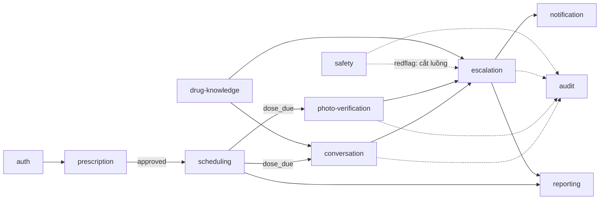

# Domains — VMEC-04

> **Owner:** Architect (Nguyễn Minh Đạt) + PM (Nguyễn Hải Yến) · **Cập nhật khi:** thêm/bớt/tái cấu trúc domain
> Danh sách các domain nghiệp vụ trong hệ thống. Đây là cơ sở để chia task, chia quyền sở hữu (ownership), và chia context cho AI (xem [ADR-0002](../adrs/0002-domain-split.md)).
> Kiểu triển khai: **Modular Monolith** — một service FastAPI duy nhất, nhưng ranh giới domain trong code phải rõ ràng (xem ADR-0002 và ADR-0004).

## Danh sách domain

| Domain | Mô tả ngắn | Module code (dự kiến) | Owner | Trạng thái |
|---|---|---|---|---|
| `auth` | Đăng nhập, JWT, phân quyền theo role (bác sĩ / bệnh nhân / người thân), liên kết bệnh nhân ↔ bác sĩ ↔ người thân | `backend/api/auth/`, `backend/services/auth/` | Trương Quốc Trường | Planned |
| `prescription` | Phác đồ điều trị: bác sĩ tạo, chỉnh sửa, **duyệt** (HITL). Nguồn sự thật cho mọi lịch nhắc | `backend/services/prescription/` | Trương Quốc Trường | Planned |
| `scheduling` | Sinh `dose_event` từ phác đồ đã duyệt, dose window ±30 phút, cron 1 phút quét liều đến hạn, nhắc 3 cấp độ | `backend/services/scheduling/` | Trương Quốc Trường | Planned |
| `conversation` | Hội thoại bệnh nhân ↔ agent; phân loại 4 nhãn Taken/Missed/Delayed/SideEffect; hỏi lại khi confidence thấp | `backend/agents/nodes/phan_loai_hoi_thoai.py` | Phạm Thành Đạt | Planned |
| `photo-verification` | Nhận ảnh thuốc, vision đếm viên, đối chiếu phác đồ, tối đa 2 lần chụp lại → fallback người thân duyệt | `backend/agents/tools/vision.py`, `backend/services/photo/` | Nguyễn Minh Đạt | Planned |
| `drug-knowledge` | Dữ liệu thuốc có nguồn + RAG trên pgvector (chỉ định, tác dụng phụ, tương tác, mức nguy hiểm khi bỏ liều) | `backend/agents/tools/rag.py`, `data pharmacy/` | Nguyễn Minh Đạt | In progress |
| `safety` | Lớp an toàn song song: keyword rules OR LLM, phát hiện triệu chứng nguy hiểm, cắt luồng + escalate khẩn | `backend/services/safety/` | Phạm Thành Đạt | Planned |
| `escalation` | Quyết định mức Nhẹ/Trung bình/Nghiêm trọng và gửi cảnh báo tới người thân/bác sĩ; hàng đợi cảnh báo cho caregiver | `backend/services/escalation/`, `backend/agents/nodes/escalate.py` | Phạm Thành Đạt | Planned |
| `notification` | Kênh gửi thực tế (push/PWA notification, in-app), retry, template thông báo theo cấp độ | `backend/agents/tools/notification.py` | Nguyễn Hải Yến | Planned |
| `reporting` | Dashboard tuân thủ cho bác sĩ (tự khai vs có xác minh), heatmap lịch sử cho người thân | `backend/services/reporting/` | Nguyễn Hải Yến | Planned |
| `audit` | Ghi log mọi hành động của agent: reasoning, confidence, nguồn RAG, phiên bản prompt | `backend/services/audit/` | Trương Quốc Trường | Planned |

> Reviewer bắt buộc theo domain: xem [`TEAM.md`](../TEAM.md) §2.

## Ranh giới giữa các domain

Nguyên tắc: **domain nào sở hữu dữ liệu nào thì domain đó là nguồn sự thật duy nhất cho dữ liệu đó.** Domain khác đọc/ghi thông qua contract (xem [`api-contracts.md`](./api-contracts.md)), không truy cập thẳng bảng của nhau.

| Ranh giới | Ai sở hữu | Ai tiêu thụ | Qua contract nào |
|---|---|---|---|
| Phác đồ & trạng thái duyệt | `prescription` | `scheduling`, `photo-verification`, `reporting` | `PrescriptionDTO` |
| `dose_event` (lịch nhắc, dose window, trạng thái liều) | `scheduling` | `conversation`, `photo-verification`, `escalation`, `reporting` | `DoseEventDTO`, event `scheduling.dose_due` |
| Nhãn phân loại hội thoại | `conversation` | `escalation`, `reporting` | event `conversation.classified` |
| Kết quả đối chiếu ảnh | `photo-verification` | `escalation`, `reporting` | event `photo.verified` |
| Thông tin thuốc (RAG) | `drug-knowledge` | `conversation`, `escalation` | `DrugInfoDTO` (kèm `source` bắt buộc) |
| Cờ đỏ triệu chứng | `safety` | `escalation` (ưu tiên cao nhất, cắt luồng chính) | event `safety.redflag` |
| Cảnh báo đã gửi | `escalation` | `notification`, `reporting` | `EscalationDTO` |

**Ràng buộc bắt buộc:**

- `safety` **chạy song song và độc lập** với `conversation` — không được để lỗi/độ trễ của `conversation` chặn `safety` (xem ADR-0009).
- `scheduling` **chỉ sinh `dose_event` từ phác đồ ở trạng thái `approved`** — không bao giờ từ phác đồ `draft`/`pending` (xem ADR-0010).
- `drug-knowledge` **không bao giờ trả thông tin không có `source`** — nếu không tìm được nguồn, trả rỗng để agent nói "không có thông tin" thay vì bịa.
- `audit` được ghi bởi mọi domain nhưng **không domain nào được xoá/sửa** bản ghi audit.

## Sơ đồ phụ thuộc

---
**Lưu ý cho AI:** Khi làm task thuộc một domain, chỉ cần đọc context của domain/module đó + contract liên quan — không cần đọc sâu code của domain khác (giảm "over-context"). Nếu cần hiểu domain khác, hãy đọc qua [`api-contracts.md`](./api-contracts.md) trước, không đọc trực tiếp code nội bộ của domain đó trừ khi thực sự cần thiết.
